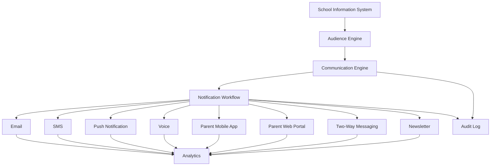
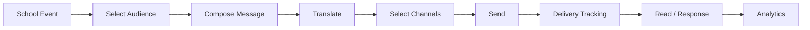
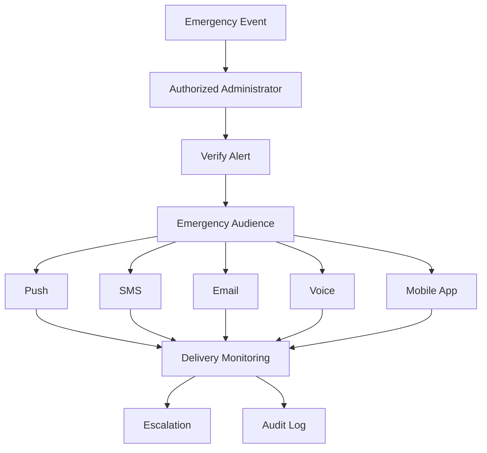
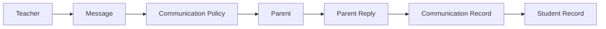
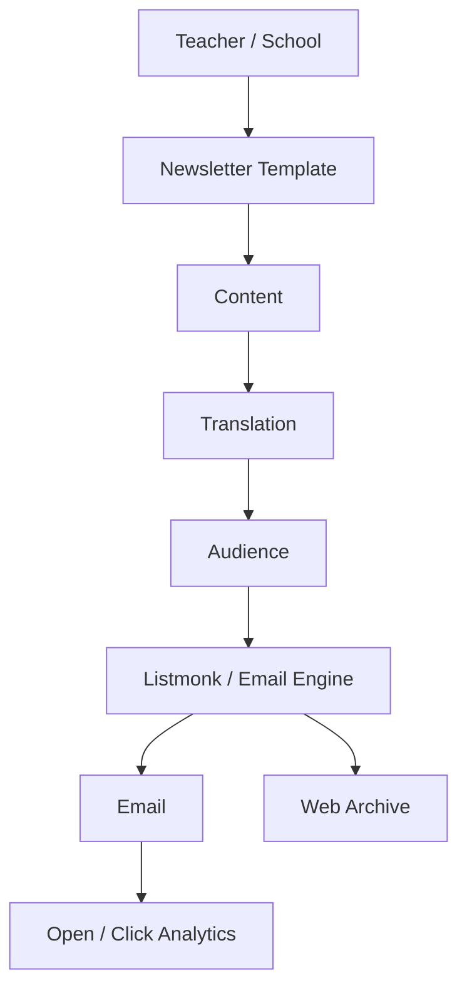
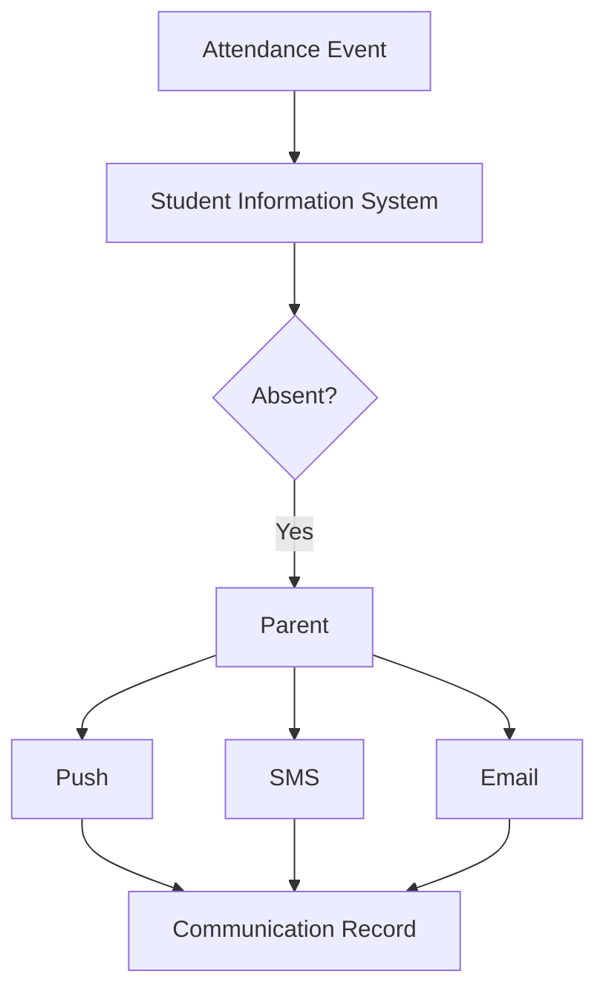
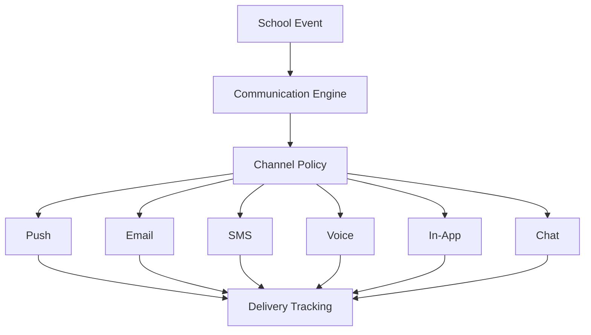

# Awesome-School-Communication

## Top School Communication Platforms

**A comprehensive ecosystem of school-home communication, parent engagement, mass notification, messaging, newsletters and open-source school communication platforms**

*Open-source-first reference covering K-12 family communication, parent-teacher messaging, emergency alerts, mass notifications, newsletters, announcements, school apps, two-way communication and the infrastructure required to build self-hosted alternatives.*

**Last updated: September 2026**

School communication platforms help schools, teachers and districts communicate with students, parents, guardians and staff through:

* SMS
* email
* voice calls
* push notifications
* mobile applications
* web portals
* two-way messaging
* emergency alerts
* school announcements
* newsletters
* calendars
* attendance notifications
* parent-teacher communication
* multilingual communication
* audience segmentation
* surveys and forms
* school-community engagement

Examples include **SchoolMessenger, Finalsite Messages, ParentSquare, Apptegy Thrillshare, Blackboard Mass Notifications, Remind, Edlio, SchoolStatus, Smore and Konstella**.

Modern school communication platforms increasingly combine:

```text
School Website
      +
Mobile App
      +
Parent Portal
      +
Teacher Messaging
      +
Mass Notifications
      +
Emergency Alerts
      +
Newsletters
      +
SMS / Email / Voice
      +
Translation
      +
Audience Segmentation
      +
School Data
```

The commercial market is increasingly moving toward unified communication platforms rather than isolated announcement tools. Apptegy's 2026 comparison, for example, frames the category around communication consolidation, family engagement, safety and scale.

This README focuses particularly on **open-source alternatives and composable building blocks** that can be used to construct school communication systems without depending entirely on proprietary platforms.

## Open-source emphasis

The open-source ecosystem is fragmented. There are relatively few mature, direct open-source equivalents to ParentSquare or SchoolMessenger.

Therefore this README separates:

1. **Direct / near-direct open-source school communication systems**
2. **Open-source school management systems with communication modules**
3. **Open-source notification infrastructure**
4. **Open-source messaging platforms**
5. **Open-source email/SMS/voice infrastructure**
6. **Open-source collaboration platforms**
7. **Open-source newsletter and publishing systems**
8. **Open-source authentication, workflow and data infrastructure**

> **Important:** A school-management system with an announcements module is not automatically equivalent to a dedicated school communication platform. Likewise, a generic messaging server is not automatically a ParentSquare or SchoolMessenger replacement.

A realistic open-source implementation may therefore combine several projects:

```text
School Management
       ↓
Parent / Student Directory
       ↓
Communication Engine
       ↓
Notification Infrastructure
       ↓
SMS / Email / Push / Voice
       ↓
Parent Mobile / Web App
```

There are already community projects specifically targeting school communication. For example, `School-Notification-Managment-System` provides teacher posts, student/parent access and in-app/email notifications, while Gibbon is an established open-source school-management platform designed for teachers, students, parents and school leaders.

Contributions and corrections are welcome.

---

## Table of Contents

* [SaaS/Hosted Platforms](#saashosted-platforms)
* [Open-Source School Communication Platforms](#open-source-school-communication-platforms)
* [Open-Source School Management Platforms with Communication](#open-source-school-management-platforms-with-communication)
* [Open-Source Notification Infrastructure](#open-source-notification-infrastructure)
* [Open-Source Messaging Platforms](#open-source-messaging-platforms)
* [Open-Source Email, SMS & Voice Infrastructure](#open-source-email-sms--voice-infrastructure)
* [Open-Source Newsletter & Publishing Platforms](#open-source-newsletter--publishing-platforms)
* [Open-Source Collaboration Platforms](#open-source-collaboration-platforms)
* [Open-Source Authentication & Identity](#open-source-authentication--identity)
* [Additional Strong Open-Source Options](#additional-strong-open-source-options)
* [Commercial Platform → Open-Source Equivalents](#commercial-platform--open-source-equivalents)
* [Frameworks for Building Custom School Communication Systems](#frameworks-for-building-custom-school-communication-systems)
* [Reference Architecture](#reference-architecture)
* [Typical School Communication Workflow](#typical-school-communication-workflow)
* [Emergency Notification Workflow](#emergency-notification-workflow)
* [Parent-Teacher Messaging Workflow](#parent-teacher-messaging-workflow)
* [Newsletter Workflow](#newsletter-workflow)
* [Attendance Notification Workflow](#attendance-notification-workflow)
* [Multichannel Notification Architecture](#multichannel-notification-architecture)
* [Capability Matrix](#capability-matrix)
* [Recommended Open-Source Stacks](#recommended-open-source-stacks)
* [What Is Still Difficult to Reproduce in Open Source?](#what-is-still-difficult-to-reproduce-in-open-source)
* [Why Open Source Is Interesting](#why-open-source-is-interesting)
* [How to Contribute](#how-to-contribute)
* [Disclaimer](#disclaimer)

---

# SaaS/Hosted Platforms

These are commercial, hosted or enterprise-oriented school communication platforms.

| Platform | Primary Model | Main Strength | Pricing | Free Tier Limit |
| --- | --- | --- | --- | --- |
| [SchoolMessenger](https://www.schoolmessenger.com/) | K-12 mass communication | Emergency + mass notifications | Starts at ~$2.00–$5.00 / student / year (min. annual contract ~$2,000–$5,000 / year) | No permanent free tier for schools (mobile app 100% free for parents); 30-day evaluation pilot on sales request |
| [Finalsite Messages](https://www.finalsite.com/) | School communications | Websites + messaging + engagement | Starts at ~$2.00–$3.00 / student / year (min. annual contract ~$2,000 / year) | No permanent free tier; 30-day sandbox evaluation trial available upon sales request |
| [ParentSquare](https://www.parentsquare.com/) | Family engagement | Two-way communication + mass notifications | Starts at ~$3,000 / year base per school site (~$2.00–$4.00 / student / year) | No permanent free tier for schools (100% free for parents & students); 30-day pilot / guided demo on sales request |
| [Apptegy Thrillshare](https://www.apptegy.com/) | District communication | Website + app + mass communication | Starts at ~$4,000–$7,500 / year base per district + ~$2.50–$3.50 / student / year | No permanent free tier; 30-day district evaluation pilot and interactive demo on request |
| [Blackboard Mass Notifications](https://www.blackboard.com/teaching-learning/communication-collaboration/mass-notifications) | Emergency/mass notification | Alerts + institutional messaging | Starts at ~$2.00–$3.50 / student / year (min. annual contract ~$2,500 / year) | No permanent free tier; 30-day pilot / sandbox demo environment on request |
| [Remind](https://www.remind.com/) | Teacher/family messaging | Simple two-way school-home messaging | Free for teachers; Remind Hub starts at ~$4,000 / year (~$3.00–$5.00 / student / year) | Free forever plan (Remind Chat) supports up to 10 classes per teacher and 150 participants per class; custom pilot for Hub |
| [Edlio](https://www.edlio.com/) | School communications | Website + CMS + mobile communication | Starts at ~$2,500–$4,500 / year base per school site + setup fees | No permanent free tier; 30-day full-feature sandbox demo / trial on sales request |
| [SchoolStatus](https://www.schoolstatus.com/) | Family engagement | Data-driven communication | Starts at ~$2.00–$4.00 / student / year (base campus fee ~$1,500–$3,000 / school / year) | No permanent free tier for core platform; 30-day district pilot / guided walkthrough on request |
| [Smore](https://www.smore.com/) | School newsletters | Newsletter creation + distribution | Free tier available; Educator Pro starts at $79.00 / year ($15.00 / month); Team plans from $399.00 / year | Free forever plan allows up to 5 newsletters with Smore branding; Pro plan offers a 30-day free trial (no credit card required) |
| [Konstella](https://www.konstella.com/) | Parent/school community | School-community communication | Starts at $424 / year (Basic), $849 / year (Premium), and $1,049 / year (Platinum) flat fee per school | No permanent free tier for schools (100% free for parents & PTA members); 30-day free trial for parent associations |
| [TalkingPoints](https://talkingpts.org/) | Family engagement | Multilingual two-way communication | $0 for individual teachers; School/District plans start at ~$2.50–$4.00 / student / year | Free forever teacher plan includes up to 5 classes and 200 students with 2-way translation; 30-day district pilot on request |
| [ClassDojo](https://www.classdojo.com/) | Family engagement | Teacher-parent communication | $0 for teachers & schools; optional ClassDojo Plus for families at $15.49 / month ($59.99 / year) | 100% Free forever for teachers, schools, and families (unlimited messaging & class stories); 7-day free trial for ClassDojo Plus |
| [Bloomz](https://www.bloomz.com/) | School communication | Messaging + announcements + parent engagement | Free tier available; Teacher Premium at $125.00 / year; Schoolwide Premium starts at ~$3.00 / student / year (~$1,500/yr min) | Free forever teacher plan (1 class, up to 30 students, 1 Admin + 1 Co-Teacher); 14-day free trial for Teacher Premium |
| [ParentSquare (District Tier)](https://www.parentsquare.com/) | Family engagement | District-wide communication | Starts at ~$5,000–$10,000 / year district base (~$1.75–$3.00 / student / year) | No permanent free tier for districts (free mobile app for parents); 30-day district evaluation pilot on request |
| [SchoolStatus Connect](https://www.schoolstatus.com/products/connect-family-school-partnerships) | Family engagement | Messaging + mass notifications + newsletters | Free for teachers; School/District packages start at ~$2.00–$3.00 / student / year (ad-free teacher at $3.99 / month) | Free forever for classroom teachers (unlimited family messaging, announcements, and translation); 30-day trial pilot for districts |
| [Blackboard](https://www.anthology.com/products/teaching-and-learning/learning-effectiveness/blackboard) | Education platform | Institutional communication ecosystem | Starts at ~$9,500 / year base for small institutions (or ~$25.00–$40.00 / FTE student / year) | Free 30-day trial of Blackboard Learn (up to 5 courses, 25 students, full instructor tools; no credit card required) |
| [PowerSchool](https://www.powerschool.com/) | Education platform | SIS + family communication ecosystem | Starts at ~$5.00–$8.00 / student / year (typical min. annual contract ~$3,000–$5,000 / year) | No permanent free tier for schools (PowerSchool Mobile app is 100% free for parents & students); 30-day sandbox pilot on sales request |
| [Finalsite](https://www.finalsite.com/) | K-12 digital platform | Websites + communications | Starts at ~$3,500–$6,000 / year base + implementation & template setup fees | No permanent free tier; 30-day sandbox trial environment available upon sales consultation |
| [SchoolInfoApp](https://www.schoolinfoapp.com/) | School communication | Mobile app + notifications | Starts at ~$1,500 / year base per school (~$1.50–$2.50 / student / year + setup fee) | No permanent free tier for schools (mobile app 100% free for parents/students); 30-day pilot trial on request |
| [TeacherEase](https://www.teacherease.com/) | School communication | Parent/teacher communication | Starts at $175.67 / teacher / year (tier for 1–19 teachers; no per-student fee) | No permanent free tier for teachers (parent & student access is 100% free); 30-day guided pilot / demo for schools on request |
| [Campus Suite](https://www.campussuite.com/) | School websites/communication | Websites + mobile communication | Starts at ~$2,500–$4,000 / year base per school (~$1.50–$3.00 / student / year) | No permanent free tier; 30-day interactive sandbox demo / trial environment on request |

SchoolStatus Connect currently combines mass notifications, two-way messaging, a family app and Smore newsletters, illustrating how the market is converging toward unified communications hubs.

### Important 2026 market note

**Remind is now part of ParentSquare.** ParentSquare announced its acquisition of Remind and described the combination as bringing together two major K-12 communication platforms.

---

# Open-Source School Communication Platforms

The strongest open-source options are generally **school-management platforms with communication capabilities** plus a smaller number of dedicated communication projects.

---

# 1. Gibbon

[GitHub](https://github.com/GibbonEdu/core)

[Website](https://gibbonedu.org/)

Gibbon is one of the most established open-source school-management platforms.

It is designed for:

* teachers
* students
* parents
* school leaders
* administrators

The core platform is GPL-3.0 and supports extensibility through modules and themes.

Relevant communication capabilities can include:

* school notices
* parent/student information
* messaging-related workflows
* calendars
* activities
* attendance
* student records
* school administration

Gibbon is therefore an important **open-source foundation** for building a school communication platform.

---

# 2. School Notification Management System

[GitHub](https://github.com/fadkeabhi/School-Notification-Managment-System)

A community-built project specifically oriented around school notifications.

Features include:

* administrator module
* teachers
* classes
* students
* teacher posts
* parent/student access
* in-app notifications
* email notifications

The project was developed as a school notification-management application using React, Node.js/Express and MongoDB.

It is closer to the communication use case than a generic school ERP.

---

# 3. School OS

[GitHub](https://github.com/shabirkhan-dev/school-os)

School OS is a modern mobile-first school platform emphasizing parent communication and safety.

Its architecture includes:

```text
Next.js
+
Expo
+
NestJS
+
FastAPI
+
Docker
```

Its communication-oriented concept starts with attendance and WhatsApp alerts and expands toward school communication, academics, finance and teaching tools.

Useful for studying a modern:

```text
School
 ↓
Student
 ↓
Attendance
 ↓
Parent
 ↓
Instant Notification
```

architecture.

---

# 4. Parent-Teacher Portal

[GitHub](https://github.com/GIT-ARYA/PTPortal)

A full-stack parent-teacher communication and student-progress application.

Features include:

* parent accounts
* teacher accounts
* administrator accounts
* real-time messaging
* student progress
* attendance
* grades
* announcements
* notifications
* meeting scheduling

It is a useful reference implementation for building a smaller ParentSquare-like system.

---

# 5. eCommunicationBook

[GitHub](https://github.com/Bennacci/eCommunicationBook)

A digital communication-book concept designed specifically for parents and teachers.

It supports:

* parent/teacher roles
* attendance
* class performance
* learning progress
* homework
* school calendar
* events
* parent-teacher communication

It is particularly useful as a conceptual example of a **digital school-home communication diary**.

---

# 6. School Management System — MERN

[GitHub](https://github.com/saismrutiranjan18/School-Management-System)

This project includes:

* school announcements
* class-specific communication
* real-time push notifications
* email blasts
* parent-teacher messaging
* attendance alerts
* calendar
* student/parent accounts

It demonstrates how school communication can be integrated directly into the school-management platform.

---

# 7. School Management System — PHP

[GitHub](https://github.com/crazymodifier/school-management-system)

A school-management platform with:

* student panel
* teacher panel
* parent panel
* administrator panel
* announcements
* messaging
* attendance notifications
* parent communication

It provides a practical reference for a self-hosted school portal with integrated communications.

---

# 8. SchoolMS

[GitHub](https://github.com/TemiKayode/School-Management-System)

A more recent full-stack school-management platform featuring:

* role-based dashboards
* announcements
* notifications
* real-time messaging
* parent/teacher communication
* push notifications
* monitoring
* GDPR-related controls

The project explicitly includes in-app and push notifications, role-scoped messaging and school-wide announcements.

---

# 9. School Management Software

[GitHub](https://github.com/okoyechuka/school-managment-software)

Includes a communication module supporting:

* bulk SMS
* email
* parent communication
* student communication
* staff communication
* internal messaging

It is particularly interesting because communication is treated as a dedicated module rather than merely an announcement feature.

---

# Open-Source School Management Platforms with Communication

These projects are not direct ParentSquare/SchoolMessenger replacements, but they can provide the **student-family data model** required by a communication platform.

## OpenEduCat

[GitHub](https://github.com/openeducat/openeducat_erp)

Provides:

* student management
* parent management
* teacher management
* attendance
* academic management
* communication
* portals

---

## Fedena

[GitHub](https://github.com/projectfedena/fedena)

Open-source school-management platform with:

* student records
* parents
* teachers
* attendance
* announcements
* messaging
* school administration

---

## RosarioSIS

[GitHub](https://github.com/francoisjacquet/rosariosis)

Open-source student information system.

Useful for:

* student records
* parent records
* attendance
* scheduling
* school information
* notifications

---

## Frappe Education

[GitHub](https://github.com/frappe/education)

Education module built around the Frappe ecosystem.

Can provide:

* students
* guardians
* courses
* programs
* attendance
* academic structure
* communication workflows

---

## OpenSIS

[GitHub](https://github.com/OS4Ed/openSIS-Classic)

Open-source student information system useful as a data source for communication systems.

---

## AlekSIS

[GitHub](https://github.com/AlekSIS/official)

Open-source school information system.

---

## Sentrifugo

[GitHub](https://github.com/sapplica/sentrifugo)

Primarily an HR system, but useful as a reference for role-based organizational communication infrastructure.

---

# Open-Source Notification Infrastructure

A dedicated school communication system needs a notification engine.

---

# 1. Novu

[GitHub](https://github.com/novuhq/novu)

Novu provides an open-source notification infrastructure with:

* in-app notifications
* push
* email
* SMS
* chat
* notification workflows
* preferences
* templates
* provider abstraction

Its architecture is particularly suitable for building:

```text
School Event
     ↓
Notification Workflow
     ↓
SMS / Email / Push / In-App
```

Novu explicitly provides a unified API for multi-channel notification delivery.

---

# 2. Gotify

[GitHub](https://github.com/gotify/server)

Self-hosted push notification server.

Useful for:

* emergency notifications
* internal school alerts
* administrative notifications
* system notifications

---

# 3. ntfy

[GitHub](https://github.com/binwiederhier/ntfy)

Simple HTTP-based publish/subscribe notification system.

Example:

```text
School Event
     ↓
ntfy Topic
     ↓
Parent Devices
```

Useful for lightweight self-hosted push notifications.

---

# 4. Apprise

[GitHub](https://github.com/caronc/apprise)

Apprise provides a common interface for sending notifications through many services.

Useful as an integration layer:

```text
School System
     ↓
Apprise
     ↓
Email / SMS / Push / Chat
```

---

# 5. Node-RED

[GitHub](https://github.com/node-red/node-red)

Visual workflow automation.

Useful for:

* attendance alerts
* emergency messages
* scheduled announcements
* event reminders
* notification routing

---

# 6. n8n

[GitHub](https://github.com/n8n-io/n8n)

Workflow automation platform useful for connecting:

```text
SIS
 ↓
n8n
 ↓
Notification Provider
```

---

# 7. Temporal

[GitHub](https://github.com/temporalio/temporal)

Useful for reliable long-running communication workflows.

Examples:

```text
Emergency Alert
 ↓
Send SMS
 ↓
Wait
 ↓
Check delivery
 ↓
Retry
 ↓
Escalate to voice
```

---

# Open-Source Messaging Platforms

Generic messaging platforms can provide the communication layer of a school system.

---

## Mattermost

[GitHub](https://github.com/mattermost/mattermost)

Useful for:

* staff communication
* teacher groups
* administration
* school departments
* internal messaging

---

## Rocket.Chat

[GitHub](https://github.com/RocketChat/Rocket.Chat)

Supports:

* channels
* direct messaging
* groups
* file sharing
* integrations
* notifications

---

## Matrix / Synapse

[GitHub](https://github.com/element-hq/synapse)

Matrix provides decentralized real-time communication.

Potential school architecture:

```text
School
 ↓
Matrix Server
 ↓
Teachers / Parents / Students
```

---

## Element

[GitHub](https://github.com/element-hq/element-web)

Matrix client for web-based communication.

---

## Zulip

[GitHub](https://github.com/zulip/zulip)

Threaded team communication platform.

Useful for:

* teacher teams
* departments
* school administration

---

## Nextcloud Talk

[GitHub](https://github.com/nextcloud/spreed)

Provides:

* messaging
* calls
* video
* file sharing
* collaboration

---

# Open-Source Email, SMS & Voice Infrastructure

SchoolMessenger-like functionality requires more than an application.

It requires communication channels.

---

# Email

## Postal

[GitHub](https://github.com/postalserver/postal)

Open-source mail delivery platform.

---

## Mailcow

[GitHub](https://github.com/mailcow/mailcow-dockerized)

Self-hosted email infrastructure.

---

## Mailu

[GitHub](https://github.com/mailu/mailu)

Open-source mail server suite.

---

## Listmonk

[GitHub](https://github.com/knadh/listmonk)

High-performance self-hosted newsletter and mailing-list manager.

Excellent for:

* school newsletters
* parent mailing lists
* announcements
* bulk email

---

# SMS

Open-source software can provide the application layer, but **SMS delivery still normally requires a telecom/SMS gateway**.

Possible architectures include:

```text
School Platform
      ↓
SMS Gateway API
      ↓
Mobile Network
      ↓
Parent
```

Open-source / self-hosted components can include:

* [Jasmin SMS Gateway](https://github.com/jookies/jasmin)
* [Kannel](https://github.com/kannel-sms/kannel)
* [Gammu](https://github.com/gammu/gammu)
* [PlaySMS](https://github.com/playsms/playsms)

---

# Voice

Voice broadcasting is more difficult to self-host completely.

Useful open-source components include:

* [Asterisk](https://github.com/asterisk/asterisk)
* [FreeSWITCH](https://github.com/signalwire/freeswitch)
* [Jambonz](https://github.com/jambonz/sbc-in-the-cloud)

Architecture:

```text
School Alert
      ↓
Voice Workflow
      ↓
Asterisk / FreeSWITCH
      ↓
Telephony Provider
      ↓
Parent Phone
```

---

# Open-Source Newsletter & Publishing Platforms

## Listmonk

[GitHub](https://github.com/knadh/listmonk)

Excellent for high-volume school newsletters.

---

## Mautic

[GitHub](https://github.com/mautic/mautic)

Open-source marketing automation platform.

Potential uses:

* segmented parent communication
* campaigns
* email journeys
* engagement tracking

---

## Ghost

[GitHub](https://github.com/TryGhost/Ghost)

Useful for:

* school news
* publications
* newsletters
* public communications

---

## WordPress

[GitHub](https://github.com/WordPress/wordpress-develop)

Useful for:

* school websites
* announcements
* newsletters
* parent resources
* event publishing

---

## Drupal

[GitHub](https://github.com/drupal/drupal)

Powerful open-source CMS for district/school websites and publishing.

---

# Open-Source Collaboration Platforms

| Platform                                                        | Main Use                      |
| --------------------------------------------------------------- | ----------------------------- |
| [Mattermost](https://github.com/mattermost/mattermost)          | Internal school communication |
| [Rocket.Chat](https://github.com/RocketChat/Rocket.Chat)        | Messaging                     |
| [Matrix](https://github.com/element-hq/synapse)                 | Federated messaging           |
| [Element](https://github.com/element-hq/element-web)            | Matrix client                 |
| [Zulip](https://github.com/zulip/zulip)                         | Threaded communication        |
| [Nextcloud Talk](https://github.com/nextcloud/spreed)           | Chat/video                    |
| [Jitsi Meet](https://github.com/jitsi/jitsi-meet)               | Video communication           |
| [BigBlueButton](https://github.com/bigbluebutton/bigbluebutton) | Online classes/meetings       |

---

# Open-Source Authentication & Identity

A school communication platform needs strong identity management.

## Keycloak

[GitHub](https://github.com/keycloak/keycloak)

Provides:

* SSO
* OAuth
* OpenID Connect
* SAML
* RBAC
* identity federation

---

## Authentik

[GitHub](https://github.com/goauthentik/authentik)

Useful for:

* school SSO
* parent portal authentication
* staff authentication
* application access

---

## Authelia

[GitHub](https://github.com/authelia/authelia)

Self-hosted authentication and authorization layer.

---

# Additional Strong Open-Source Options

## School-specific projects

* [Gibbon](https://github.com/GibbonEdu/core)
* [Fedena](https://github.com/projectfedena/fedena)
* [OpenEduCat](https://github.com/openeducat/openeducat_erp)
* [RosarioSIS](https://github.com/francoisjacquet/rosariosis)
* [Frappe Education](https://github.com/frappe/education)
* [OpenSIS](https://github.com/OS4Ed/openSIS-Classic)
* [AlekSIS](https://github.com/AlekSIS/official)
* [School Notification Management System](https://github.com/fadkeabhi/School-Notification-Managment-System)
* [School OS](https://github.com/shabirkhan-dev/school-os)
* [Parent-Teacher Portal](https://github.com/GIT-ARYA/PTPortal)
* [eCommunicationBook](https://github.com/Bennacci/eCommunicationBook)
* [SchoolMS](https://github.com/TemiKayode/School-Management-System)
* [School Management System](https://github.com/crazymodifier/school-management-system)

## Notification infrastructure

* [Novu](https://github.com/novuhq/novu)
* [Gotify](https://github.com/gotify/server)
* [ntfy](https://github.com/binwiederhier/ntfy)
* [Apprise](https://github.com/caronc/apprise)
* [Node-RED](https://github.com/node-red/node-red)
* [n8n](https://github.com/n8n-io/n8n)
* [Temporal](https://github.com/temporalio/temporal)

## Messaging

* [Mattermost](https://github.com/mattermost/mattermost)
* [Rocket.Chat](https://github.com/RocketChat/Rocket.Chat)
* [Synapse](https://github.com/element-hq/synapse)
* [Element](https://github.com/element-hq/element-web)
* [Zulip](https://github.com/zulip/zulip)
* [Nextcloud Talk](https://github.com/nextcloud/spreed)

## Email / Newsletter

* [Listmonk](https://github.com/knadh/listmonk)
* [Mautic](https://github.com/mautic/mautic)
* [Postal](https://github.com/postalserver/postal)
* [Mailcow](https://github.com/mailcow/mailcow-dockerized)
* [Mailu](https://github.com/mailu/mailu)

## SMS / Voice

* [Jasmin SMS Gateway](https://github.com/jookies/jasmin)
* [Kannel](https://github.com/kannel-sms/kannel)
* [Gammu](https://github.com/gammu/gammu)
* [PlaySMS](https://github.com/playsms/playsms)
* [Asterisk](https://github.com/asterisk/asterisk)
* [FreeSWITCH](https://github.com/signalwire/freeswitch)
* [Jambonz](https://github.com/jambonz/sbc-in-the-cloud)

## Collaboration

* [Nextcloud](https://github.com/nextcloud/server)
* [Jitsi Meet](https://github.com/jitsi/jitsi-meet)
* [BigBlueButton](https://github.com/bigbluebutton/bigbluebutton)

---

# Commercial Platform → Open-Source Equivalents

| Commercial / Hosted Platform              | Closest Open-Source Options                         | Notes                                                    |
| ----------------------------------------- | --------------------------------------------------- | -------------------------------------------------------- |
| **SchoolMessenger**                       | Gibbon + Novu + Jasmin + Asterisk                   | Strong DIY mass-notification architecture                |
| **Finalsite Messages**                    | Gibbon + WordPress/Drupal + Novu                    | CMS + communication combination                          |
| **ParentSquare**                          | Gibbon + School Notification System + Novu + Matrix | Two-way family communication requires custom integration |
| **Apptegy Thrillshare**                   | WordPress/Drupal + Gibbon + Novu                    | Website + app + notification architecture                |
| **Blackboard Mass Notifications**         | Novu + ntfy + Jasmin + Asterisk                     | Notification infrastructure                              |
| **Remind**                                | Matrix + Rocket.Chat + Novu + school portal         | Messaging-first alternative                              |
| **Edlio**                                 | WordPress/Drupal + Gibbon + Novu                    | Website + communication                                  |
| **SchoolStatus**                          | Gibbon + SIS + Novu + analytics                     | Data-driven family engagement requires integration       |
| **Smore**                                 | Listmonk + Mautic + WordPress                       | Newsletter/publishing alternative                        |
| **Konstella**                             | Matrix/Rocket.Chat + Gibbon + Novu                  | Community messaging                                      |
| **TalkingPoints**                         | Matrix + translation APIs + Novu                    | Multilingual messaging requires additional components    |
| **ClassDojo**                             | Gibbon + Matrix + Novu                              | Parent/teacher engagement                                |
| **Bloomz**                                | Gibbon + Rocket.Chat + Novu                         | Communication + school-management stack                  |
| **SchoolInfoApp**                         | Gibbon + PWA + Novu                                 | School mobile communication                              |
| **Campus Suite**                          | WordPress/Drupal + Novu                             | CMS + communication                                      |
| **Generic school communication platform** | Gibbon + Novu + Listmonk + Matrix                   | Strong modular starting point                            |

---

# Frameworks for Building Custom School Communication Systems

A complete open-source school communication system can be constructed from several layers.

## 1. Student Information Layer

The system needs:

```text
School
 ├── Campus
 ├── Grade
 ├── Class
 ├── Student
 ├── Parent
 ├── Guardian
 ├── Teacher
 └── Staff
```

Potential foundations:

* Gibbon
* Fedena
* OpenEduCat
* RosarioSIS
* Frappe Education
* OpenSIS

---

# 2. Audience Management

A communication platform needs sophisticated targeting.

Examples:

```text
All Parents
      ↓
Grade 8 Parents
      ↓
Grade 8A Parents
      ↓
Parents of Students Absent Today
      ↓
Parents of Students with Outstanding Fees
      ↓
Parents of Bus Route 7
```

This is one of the most important differences between a generic messaging application and a school communication platform.

---

# 3. Communication Engine

The communication engine should support:

```text
Announcement
Alert
Message
Newsletter
Survey
Reminder
Event
Emergency
```

Each communication should contain:

```text
Audience
+
Message
+
Channel
+
Priority
+
Schedule
+
Language
+
Delivery Policy
```

---

# 4. Notification Orchestration

Example:

```text
Emergency Alert
       ↓
Push
       ↓
SMS
       ↓
Email
       ↓
Voice
       ↓
Delivery Verification
       ↓
Escalation
```

Novu, Node-RED, n8n and Temporal can provide different parts of this orchestration layer.

---

# 5. Translation

Multilingual communication is especially important for K-12 family engagement.

Architecture:

```text
Teacher writes English message
          ↓
Translation Engine
          ↓
Bengali
Hindi
Spanish
Arabic
French
etc.
          ↓
Parent's preferred language
```

Potential open-source/local AI components include:

* [LibreTranslate](https://github.com/LibreTranslate/LibreTranslate)
* [Argos Translate](https://github.com/argosopentech/argos-translate)
* [NLLB](https://github.com/facebookresearch/fairseq/tree/main/examples/nllb)
* [Marian NMT](https://github.com/marian-nmt/marian-dev)

---

# 6. Mobile Application

Potential open-source technologies:

* [Flutter](https://github.com/flutter/flutter)
* [React Native](https://github.com/facebook/react-native)
* [Expo](https://github.com/expo/expo)
* [Ionic](https://github.com/ionic-team/ionic-framework)

Parent application:

```text
Login
 ↓
My Children
 ↓
Messages
 ↓
Announcements
 ↓
Calendar
 ↓
Attendance
 ↓
Events
 ↓
Emergency Alerts
 ↓
Teacher Communication
```

---

# 7. Push Notification Layer

Possible technologies:

```text
FCM
APNs
Web Push
Gotify
ntfy
Novu
```

For self-hosted web push:

```text
School Backend
       ↓
Web Push
       ↓
Parent Browser
```

---

# 8. Email Layer

Possible architecture:

```text
School Platform
       ↓
Listmonk / Postal
       ↓
SMTP
       ↓
Parent
```

---

# 9. SMS Layer

```text
School Platform
       ↓
Novu / Custom API
       ↓
Jasmin / Kannel
       ↓
Telecom SMS Gateway
       ↓
Parent
```

A telecom/SMS provider is still normally required for nationwide mobile delivery.

---

# 10. Voice Layer

```text
Emergency Alert
       ↓
Voice Workflow
       ↓
Asterisk / FreeSWITCH
       ↓
SIP / Telecom Provider
       ↓
Parent Phone
```

---

# 11. Analytics

A communication platform should measure:

```text
Sent
Delivered
Opened
Clicked
Read
Responded
Bounced
Failed
Opted Out
```

Potential open-source analytics:

* Grafana
* Metabase
* Apache Superset
* Matomo
* PostHog

---

# Reference Architecture



---

# Typical School Communication Workflow



---

# Emergency Notification Workflow

Emergency notification is one of the most important SchoolMessenger-style functions.



---

# Parent-Teacher Messaging Workflow



A school communication platform should ensure that teacher-parent communication remains associated with the correct student and school context.

---

# Newsletter Workflow



Smore is a particularly strong example of the newsletter-first model, supporting distribution through email, websites, social channels and mass-notification systems, as well as multilingual newsletters and engagement analytics.

---

# Attendance Notification Workflow



Example:

```text
Student absent
      ↓
Teacher marks absence
      ↓
SIS updated
      ↓
Communication rule triggered
      ↓
Parent receives alert
```

---

# Multichannel Notification Architecture



---

# Communication Priority Model

A useful school platform can classify messages as:

```text
INFORMATION
     ↓
ANNOUNCEMENT
     ↓
IMPORTANT
     ↓
URGENT
     ↓
EMERGENCY
```

Example:

| Priority     | Example                | Channels                   |
| ------------ | ---------------------- | -------------------------- |
| Information  | Weekly newsletter      | Email / App                |
| Announcement | School event           | App / Email                |
| Important    | Exam schedule change   | Push / Email               |
| Urgent       | Bus route cancellation | Push / SMS                 |
| Emergency    | School closure         | Push / SMS / Voice / Email |

---

# Audience Segmentation

A mature communication platform should support:

```text
District
 ├── School
 │    ├── Grade
 │    │    ├── Class
 │    │    └── Section
 │    │
 │    ├── Teachers
 │    ├── Staff
 │    └── Parents
 │
 └── Special Groups
      ├── Bus Route
      ├── Sports Team
      ├── Club
      ├── Parents of Absent Students
      └── Emergency Group
```

This is critical for avoiding:

> **"Everyone receives everything."**

---

# Communication Preferences

Each parent should ideally control:

```text
Preferred Language
Preferred Email
Preferred Phone
Push Notifications
SMS
Email
Voice
Newsletter
Emergency Alerts
Teacher Messages
```

Example:

```json
{
  "parent": "parent-001",
  "language": "en",
  "channels": {
    "push": true,
    "email": true,
    "sms": true,
    "voice": false
  },
  "emergency_override": true
}
```

Emergency communications should generally follow separate policy rules and should not be treated like ordinary marketing/newsletter opt-outs.

---

# Communication Audit Trail

Every important message should create an immutable record:

```text
Message ID
Sender
School
Audience
Student Context
Timestamp
Channel
Language
Delivery Status
Read Status
Reply
Escalation
```

Example:

```text
Message
  ↓
Sent
  ↓
Delivered
  ↓
Opened
  ↓
Read
  ↓
Replied
```

This becomes particularly important for:

* emergency alerts
* attendance notices
* safeguarding communication
* disciplinary communication
* important academic notices
* consent-related communication

---

# Parent Communication Data Model

```text
School
  │
  ├── Student
  │      │
  │      └── Guardian
  │             │
  │             ├── Email
  │             ├── Phone
  │             ├── Language
  │             └── Preferences
  │
  └── Communication
         │
         ├── Announcement
         ├── Alert
         ├── Message
         ├── Newsletter
         └── Emergency
```

---

# Communication Security

A production school communication platform should provide:

```text
Authentication
+
RBAC
+
MFA
+
Encryption
+
Audit Logging
+
Consent
+
Data Minimization
+
Access Controls
+
Retention Policies
+
Secure Messaging
```

Potential identity components:

* Keycloak
* Authentik
* Authelia

Potential infrastructure:

* PostgreSQL
* Redis
* MinIO
* OpenSearch
* Vault/OpenBao

---

# Open-Source School Communication Stack: Minimal

```text
Gibbon
   +
Novu
   +
Listmonk
   +
Gotify
```

Best for:

* small schools
* private schools
* pilot deployments
* self-hosted environments

---

# Open-Source School Communication Stack: Messaging-Centric

```text
Gibbon
   +
Matrix / Synapse
   +
Element
   +
Novu
```

Best for:

* two-way parent-teacher messaging
* school communities
* teacher groups
* controlled school chat

---

# Open-Source School Communication Stack: Mass Notification

```text
Gibbon
   +
Novu
   +
Jasmin
   +
Postal / Mailcow
   +
Asterisk
```

Provides:

```text
School Data
   ↓
Communication
   ↓
SMS
Email
Voice
```

---

# Open-Source Newsletter Stack

```text
WordPress / Drupal
        +
Listmonk
        +
Mautic
        +
PostgreSQL
```

Useful for:

* school newsletters
* district newsletters
* weekly updates
* parent campaigns
* event communications

---

# Open-Source Full School Communication Stack

```text
                    SCHOOL SIS
                       │
          ┌────────────┼────────────┐
          ↓            ↓            ↓
       Gibbon       OpenEduCat    Frappe
          │
          ↓
    Audience Engine
          │
          ↓
   Communication Engine
          │
          ↓
        Novu
          │
   ┌──────┼────────┬─────────┐
   ↓      ↓        ↓         ↓
 Push   Email      SMS      Voice
   │      │        │         │
 Gotify  Listmonk Jasmin   Asterisk
   │      │        │         │
   └──────┴────────┴─────────┘
          │
          ↓
      Parent App
          │
          ↓
      Analytics
```

---

# Capability Matrix

| Capability             | SchoolMessenger |  ParentSquare | Apptegy |        Finalsite |          Remind | SchoolStatus |           Smore |            Gibbon |               Novu |          Matrix |
| ---------------------- | --------------: | ------------: | ------: | ---------------: | --------------: | -----------: | --------------: | ----------------: | -----------------: | --------------: |
| Mass notifications     |               ✅ |             ✅ |       ✅ |                ✅ |               ✅ |            ✅ |         Limited |       Via modules |                  ✅ | Via integration |
| Two-way messaging      |               ✅ |             ✅ |       ✅ |                ✅ |               ✅ |            ✅ |         Limited |       Via modules |           Workflow |               ✅ |
| Parent portal          |               ✅ |             ✅ |       ✅ |                ✅ |               ✅ |            ✅ |               ❌ |                 ✅ |                  ❌ |               ❌ |
| School website         |   Via ecosystem | Via ecosystem |       ✅ |                ✅ |               ❌ |            ❌ |               ❌ |       Via modules |                  ❌ |               ❌ |
| Mobile app             |               ✅ |             ✅ |       ✅ |                ✅ |               ✅ |            ✅ |         Limited | Via customization |    Via integration |         Clients |
| SMS                    |               ✅ |             ✅ |       ✅ |                ✅ |               ✅ |            ✅ | Via integration |   Via integration |       Via provider | Via integration |
| Email                  |               ✅ |             ✅ |       ✅ |                ✅ |               ✅ |            ✅ |               ✅ |   Via integration |                  ✅ | Via integration |
| Voice                  |               ✅ |             ✅ |       ✅ | Via integrations |         Limited |            ✅ |               ❌ |   Via integration |       Via provider | Via integration |
| Emergency alerts       |               ✅ |             ✅ |       ✅ |                ✅ |               ✅ |            ✅ |         Limited |            Custom |                  ✅ |          Custom |
| Newsletters            |               ✅ |             ✅ |       ✅ |                ✅ |         Limited |            ✅ |               ✅ |            Custom |           Workflow |          Custom |
| Translation            |               ✅ |             ✅ |       ✅ |                ✅ |               ✅ |            ✅ |               ✅ |            Custom | Provider-dependent |          Custom |
| Audience segmentation  |               ✅ |             ✅ |       ✅ |                ✅ |         Limited |       Strong |         Limited |                 ✅ |                  ✅ |          Custom |
| Attendance integration |         Via SIS |       Via SIS | Via SIS |          Via SIS | Via integration |            ✅ |         Limited |                 ✅ |    Via integration |          Custom |
| Analytics              |               ✅ |             ✅ |       ✅ |                ✅ |         Limited |            ✅ |               ✅ |            Via BI |      Via telemetry |          Custom |
| Self-hosted            |               ❌ |             ❌ |       ❌ |                ❌ |               ❌ |            ❌ |               ❌ |                 ✅ |                  ✅ |               ✅ |
| Open source            |               ❌ |             ❌ |       ❌ |                ❌ |               ❌ |            ❌ |               ❌ |                 ✅ |                  ✅ |               ✅ |

---

# Recommended Open-Source Stacks

## 1. Best Overall School Communication Stack

```text
Gibbon
+
Novu
+
Listmonk
+
Gotify
+
Jasmin
+
Keycloak
```

Why:

```text
Gibbon
 ↓
School / Parent / Student Data

Novu
 ↓
Notification Orchestration

Listmonk
 ↓
Newsletter

Gotify
 ↓
Push

Jasmin
 ↓
SMS

Keycloak
 ↓
Identity
```

---

# 2. Best Parent-Teacher Messaging Stack

```text
Gibbon
+
Matrix / Synapse
+
Element
+
Novu
```

Best for:

* direct messaging
* parent-teacher communication
* class groups
* school communities

---

# 3. Best Mass-Notification Stack

```text
Gibbon
+
Novu
+
Jasmin
+
Postal
+
Asterisk
```

Best for:

* emergency alerts
* school closures
* transportation alerts
* weather alerts
* attendance notifications

---

# 4. Best Newsletter Stack

```text
WordPress
+
Listmonk
+
Mautic
+
PostgreSQL
```

Best for:

* weekly newsletters
* district communications
* school publications
* campaigns

---

# 5. Best Fully Self-Hosted Stack

```text
Gibbon
+
Novu
+
Matrix
+
Listmonk
+
Gotify
+
Jasmin
+
Asterisk
+
Keycloak
+
PostgreSQL
+
Redis
+
MinIO
+
Grafana
```

This provides:

```text
SIS
+
Messaging
+
Notifications
+
Email
+
SMS
+
Voice
+
Push
+
Identity
+
Storage
+
Analytics
```

---

# 6. Best Lightweight School Stack

For a small school:

```text
Gibbon
+
Novu
+
Listmonk
+
Gotify
```

This avoids the complexity of deploying a full telecom/voice stack.

---

# 7. Best Open-Source District Architecture

```text
                    DISTRICT
                       │
             ┌─────────┴─────────┐
             ↓                   ↓
          SCHOOL 1            SCHOOL 2
             │                   │
          SCHOOL 3            SCHOOL 4
             │                   │
             └─────────┬─────────┘
                       ↓
               Central SIS
                       ↓
               Audience Engine
                       ↓
            Communication Engine
                       ↓
                     Novu
                       │
      ┌────────────────┼────────────────┐
      ↓                ↓                ↓
    Email             SMS              Push
      │                │                │
   Listmonk          Jasmin           Gotify
                       │
                     Voice
                       │
                    Asterisk
```

---

# What Is Still Difficult to Reproduce in Open Source?

Open-source software can reproduce much of the technical functionality, but several parts remain challenging.

## 1. Nationwide SMS/Voice Delivery

The software can manage:

```text
Message
 ↓
Queue
 ↓
Routing
 ↓
Retry
 ↓
Delivery Status
```

but actual telecom delivery normally requires:

```text
SMS Carrier
or
Voice Carrier
```

Therefore:

> **Open source can replace the communication software layer, but it does not eliminate telecom infrastructure costs.**

---

# 2. Emergency Broadcast Reliability

SchoolMessenger-style emergency communication requires extremely high reliability.

The system must handle:

```text
Millions of recipients
+
Simultaneous delivery
+
Retries
+
Carrier failures
+
Email failures
+
Push failures
+
Voice fallback
```

This is significantly harder than sending ordinary notifications.

---

# 3. Family Identity Matching

A school communication platform needs to know:

```text
Student
 ↓
Parent
 ↓
Guardian
 ↓
Phone
 ↓
Email
 ↓
Language
 ↓
School
 ↓
Class
```

This information generally comes from the SIS.

Maintaining accurate parent/student relationships is therefore a core challenge.

---

# 4. Audience Segmentation

A mature platform can dynamically generate audiences such as:

```text
Parents of Grade 8
+
Parents of Students Absent Today
+
Parents on Bus Route 14
+
Parents of Students with Upcoming Exams
```

This requires integration with:

* SIS
* attendance
* transportation
* academic systems
* calendar
* student records

---

# 5. Multilingual Communication

Simple translation is easy.

High-quality school communication requires:

```text
Translation
+
Context
+
Names
+
School Terminology
+
Safety Terminology
+
Correct Formatting
```

A production system should also store:

```text
Original Message
+
Translated Message
+
Translation Engine
+
Translation Timestamp
```

---

# 6. Parent Adoption

Technology is not enough.

Parents need:

```text
Easy Registration
+
Simple Login
+
Reliable Notifications
+
Language Support
+
Low Data Usage
+
Accessible Web
+
Mobile Support
```

This is one reason why mature commercial platforms can be difficult to reproduce purely through software.

---

# 7. Communication Governance

Schools need policies around:

```text
Who can message whom?
Who can send emergency alerts?
Can teachers contact parents directly?
Can parents contact teachers?
What messages require approval?
How long are messages retained?
Who can export communication records?
```

This requires both:

```text
Software
+
Institutional Policy
```

---

# 8. Compliance & Privacy

School systems can contain sensitive student and family information.

A production platform should consider:

* FERPA
* COPPA
* GDPR where applicable
* local education privacy laws
* accessibility requirements
* data retention
* parental rights
* audit requirements

Open-source software does not automatically make a deployment compliant.

Compliance depends on:

```text
Software
+
Configuration
+
Infrastructure
+
Policies
+
Access Control
+
Data Processing
+
Contracts
+
Operational Procedures
```

---

# 9. AI-Assisted Communication

Modern school platforms are increasingly moving toward:

```text
AI Message Drafting
+
Translation
+
Tone Adjustment
+
Message Summarization
+
Audience Recommendation
+
Engagement Prediction
```

An open-source implementation could use:

* Ollama
* vLLM
* LlamaIndex
* LangChain
* local/open-weight LLMs

Potential workflow:

```text
Teacher Input
      ↓
AI Draft
      ↓
Safety / Policy Check
      ↓
Teacher Approval
      ↓
Translation
      ↓
Parent Delivery
```

Human approval should remain important for sensitive school communications.

---

# Why Open Source Is Interesting

The strongest opportunity is not necessarily to reproduce ParentSquare or SchoolMessenger as a single application.

Instead, schools can construct a modular:

> **Open-Source Family Engagement Platform**

around:

```text
SIS
+
Communication
+
Notifications
+
Messaging
+
Newsletter
+
Mobile App
+
Analytics
```

A modular architecture can provide greater control over:

* student data
* parent data
* communication history
* notification infrastructure
* application design
* integrations
* hosting
* costs
* data residency

---

# Open-Source School Communication Ecosystem

```text
                 SCHOOL DATA
                      │
       ┌──────────────┼──────────────┐
       ↓              ↓              ↓
    Gibbon        OpenEduCat     Frappe
       │
       ↓
 AUDIENCE ENGINE
       │
       ↓
 COMMUNICATION ENGINE
       │
       ↓
      NOVU
       │
 ┌─────┼──────┬──────┬──────┐
 ↓     ↓      ↓      ↓      ↓
Push  Email   SMS   Voice  Chat
 ↓     ↓      ↓      ↓      ↓
Gotify Listmonk Jasmin Asterisk Matrix
       │
       ↓
 PARENT EXPERIENCE
       │
 ┌─────┼────────┐
 ↓     ↓        ↓
Web   Mobile   Email
       │
       ↓
   ANALYTICS
```

---

# Best Open-Source Projects by Use Case

| Use Case                        | Recommended Projects                  |
| ------------------------------- | ------------------------------------- |
| School communication foundation | Gibbon                                |
| School management               | Gibbon, OpenEduCat, Fedena            |
| Parent/student database         | Gibbon, OpenEduCat, Frappe Education  |
| Direct school notification      | School Notification Management System |
| Parent-teacher portal           | PTPortal                              |
| Digital communication book      | eCommunicationBook                    |
| Notification orchestration      | Novu                                  |
| Push notifications              | Gotify, ntfy                          |
| Workflow automation             | n8n, Node-RED                         |
| Reliable workflows              | Temporal                              |
| Parent messaging                | Matrix, Rocket.Chat                   |
| Staff messaging                 | Mattermost, Zulip                     |
| Email                           | Postal, Mailcow, Mailu                |
| Newsletter                      | Listmonk, Mautic                      |
| SMS                             | Jasmin, Kannel, PlaySMS               |
| Voice                           | Asterisk, FreeSWITCH                  |
| School website                  | WordPress, Drupal                     |
| Mobile application              | Flutter, React Native, Expo           |
| Translation                     | LibreTranslate, Argos Translate       |
| Authentication                  | Keycloak, Authentik                   |
| Analytics                       | Grafana, Metabase, Superset           |
| Video communication             | Jitsi, BigBlueButton                  |
| File collaboration              | Nextcloud                             |
| Database                        | PostgreSQL                            |
| Cache / queues                  | Redis                                 |
| Object storage                  | MinIO                                 |

---

# Practical Full Open-Source School Communication Stack

```text
                         SCHOOL
                            │
                            ↓
                     ┌─────────────┐
                     │    Gibbon   │
                     │     SIS     │
                     └──────┬──────┘
                            │
                            ↓
                    Audience Engine
                            │
                            ↓
                  Communication Engine
                            │
                            ↓
                          Novu
                            │
       ┌────────────────────┼─────────────────────┐
       ↓                    ↓                     ↓
     Push                  Email                  SMS
       │                    │                     │
    Gotify               Listmonk              Jasmin
       │                    │                     │
       └────────────────────┼─────────────────────┘
                            ↓
                         Parents
                            │
                 ┌──────────┼──────────┐
                 ↓          ↓          ↓
               Mobile      Web       Email
                            │
                            ↓
                       Messaging
                            │
                       Matrix/Element
                            │
                            ↓
                         Analytics
                            │
                   Grafana / Metabase
```

---

# School Communication Maturity Model

```text
Level 1
---------
Email / SMS

        ↓

Level 2
---------
School Announcements

        ↓

Level 3
---------
Parent Portal

        ↓

Level 4
---------
Two-Way Messaging

        ↓

Level 5
---------
Multichannel Notifications

        ↓

Level 6
---------
Audience Segmentation

        ↓

Level 7
---------
SIS-Integrated Communication

        ↓

Level 8
---------
Personalized Family Engagement

        ↓

Level 9
---------
AI-Assisted Communication
```

The critical transition is from:

```text
Sending Messages
```

to:

```text
Sending the Right Message
to the Right Family
through the Right Channel
at the Right Time.
```

---

# Recommended Open-Source Shortlist

## Tier 1 — School Platforms

1. [Gibbon](https://github.com/GibbonEdu/core)
2. [OpenEduCat](https://github.com/openeducat/openeducat_erp)
3. [Fedena](https://github.com/projectfedena/fedena)
4. [Frappe Education](https://github.com/frappe/education)
5. [RosarioSIS](https://github.com/francoisjacquet/rosariosis)
6. [OpenSIS](https://github.com/OS4Ed/openSIS-Classic)
7. [AlekSIS](https://github.com/AlekSIS/official)

## Tier 2 — Communication-Specific Projects

8. [School Notification Management System](https://github.com/fadkeabhi/School-Notification-Managment-System)
9. [School OS](https://github.com/shabirkhan-dev/school-os)
10. [PTPortal](https://github.com/GIT-ARYA/PTPortal)
11. [eCommunicationBook](https://github.com/Bennacci/eCommunicationBook)
12. [SchoolMS](https://github.com/TemiKayode/School-Management-System)

## Tier 3 — Notification Infrastructure

13. [Novu](https://github.com/novuhq/novu)
14. [Gotify](https://github.com/gotify/server)
15. [ntfy](https://github.com/binwiederhier/ntfy)
16. [Apprise](https://github.com/caronc/apprise)
17. [n8n](https://github.com/n8n-io/n8n)
18. [Node-RED](https://github.com/node-red/node-red)
19. [Temporal](https://github.com/temporalio/temporal)

## Tier 4 — Messaging

20. [Matrix Synapse](https://github.com/element-hq/synapse)
21. [Element](https://github.com/element-hq/element-web)
22. [Rocket.Chat](https://github.com/RocketChat/Rocket.Chat)
23. [Mattermost](https://github.com/mattermost/mattermost)
24. [Zulip](https://github.com/zulip/zulip)
25. [Nextcloud Talk](https://github.com/nextcloud/spreed)

## Tier 5 — Delivery Infrastructure

26. [Listmonk](https://github.com/knadh/listmonk)
27. [Postal](https://github.com/postalserver/postal)
28. [Mailcow](https://github.com/mailcow/mailcow-dockerized)
29. [Jasmin](https://github.com/jookies/jasmin)
30. [Kannel](https://github.com/kannel-sms/kannel)
31. [PlaySMS](https://github.com/playsms/playsms)
32. [Asterisk](https://github.com/asterisk/asterisk)
33. [FreeSWITCH](https://github.com/signalwire/freeswitch)

---

# Open-Source vs Commercial Strategy

The most practical comparison is:

```text
COMMERCIAL
─────────────────────────────
ParentSquare
SchoolMessenger
Apptegy
Finalsite
SchoolStatus
Remind
Edlio
Smore
Konstella

             ↓

OPEN-SOURCE COMPOSABLE
─────────────────────────────
Gibbon
+
Novu
+
Matrix
+
Listmonk
+
Gotify
+
Jasmin
+
Asterisk
+
Keycloak
+
Grafana
```

The commercial platforms provide the advantage of:

```text
One Vendor
+
One Interface
+
Managed Infrastructure
+
Support
+
Telecom Integrations
+
Prebuilt School Integrations
+
Operational Reliability
```

The open-source approach provides:

```text
Data Ownership
+
Self Hosting
+
Customization
+
No Vendor Lock-In
+
Extensibility
+
Integration Freedom
+
Potentially Lower Software Licensing Cost
```

---

# Conclusion

The school communication market is moving beyond simple email and SMS toward integrated **family engagement platforms**.

The modern architecture looks like:

```text
School Data
    ↓
Audience Segmentation
    ↓
Communication
    ↓
Translation
    ↓
Notification Orchestration
    ↓
Push / Email / SMS / Voice
    ↓
Parent Experience
    ↓
Analytics
```

The commercial leaders — **SchoolMessenger, ParentSquare, Apptegy Thrillshare, Finalsite, SchoolStatus, Remind, Edlio, Smore and Konstella** — increasingly combine several of these capabilities in one hosted environment.

The open-source ecosystem is different.

There is currently no single universally dominant open-source equivalent of ParentSquare or SchoolMessenger. Instead, the strongest approach is composable:

```text
Gibbon
+
Novu
+
Matrix
+
Listmonk
+
Gotify
+
Jasmin
+
Asterisk
+
Keycloak
```

with optional:

```text
OpenEduCat
Frappe Education
MISP-like data integration
Nextcloud
Jitsi
Grafana
Metabase
LibreTranslate
```

The most important open-source projects to evaluate first are therefore:

> **Gibbon + Novu + Matrix + Listmonk + Gotify + Jasmin + Asterisk + Keycloak.**

This combination can form the basis of a self-hosted platform covering:

```text
School Data
+
Parent Directory
+
Teacher Communication
+
Two-Way Messaging
+
Mass Notifications
+
Emergency Alerts
+
Push Notifications
+
Email
+
SMS
+
Voice
+
Newsletters
+
Translation
+
Analytics
```

The most interesting opportunity is to turn these components into a unified:

> **Open-Source School Family Engagement Platform**

that provides:

```text
Identify
 ↓
Segment
 ↓
Compose
 ↓
Translate
 ↓
Approve
 ↓
Deliver
 ↓
Track
 ↓
Engage
 ↓
Analyze
```

without requiring a school or district to surrender control of its communication infrastructure and family data.

---

# How to Contribute

Useful contributions include:

* adding school communication platforms
* adding open-source projects
* adding parent-teacher messaging projects
* documenting SMS integrations
* documenting voice integrations
* adding notification providers
* adding multilingual tools
* creating school communication workflows
* adding emergency-alert examples
* adding attendance-notification workflows
* documenting SIS integrations
* creating parent mobile applications
* adding accessibility improvements
* documenting FERPA/GDPR considerations
* adding communication analytics
* creating audience-segmentation modules
* adding school-specific templates
* improving authentication
* adding delivery-retry mechanisms
* benchmarking notification infrastructure

Pull requests are welcome.

---

# Disclaimer

This README is an ecosystem overview rather than a product endorsement, security certification, legal opinion or guarantee of production readiness.

Open-source availability, licensing, project activity, supported integrations and features can change.

Before deploying an open-source school communication platform, evaluate:

* student-data privacy
* parent-data privacy
* authentication
* RBAC
* MFA
* encryption
* audit logging
* data retention
* consent management
* emergency-alert reliability
* SMS delivery
* voice delivery
* email deliverability
* push notification reliability
* multilingual support
* accessibility
* mobile application security
* SIS integration
* disaster recovery
* high availability
* backup
* monitoring
* incident response

**Open-source software does not automatically make a school communication system FERPA, COPPA, GDPR or otherwise legally compliant.**

Compliance depends on:

```text
Software
+
Configuration
+
Infrastructure
+
Policies
+
Access Control
+
Data Processing
+
Vendor / Telecom Agreements
+
Operational Procedures
```

> **The strongest open-source strategy is therefore not to search for a single "free ParentSquare." It is to assemble a modular school communication ecosystem in which Gibbon or another SIS provides the school-family data model, Novu provides notification orchestration, Matrix provides messaging, Listmonk provides newsletters, Gotify/ntfy provide push notifications, Jasmin/Kannel provide SMS integration and Asterisk/FreeSWITCH provide voice infrastructure.**

**School communication ultimately succeeds when the right information reaches the right family through the right channel at the right time.**

