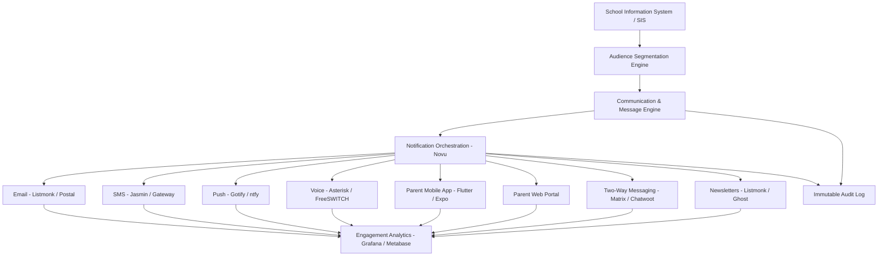
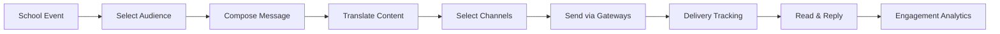
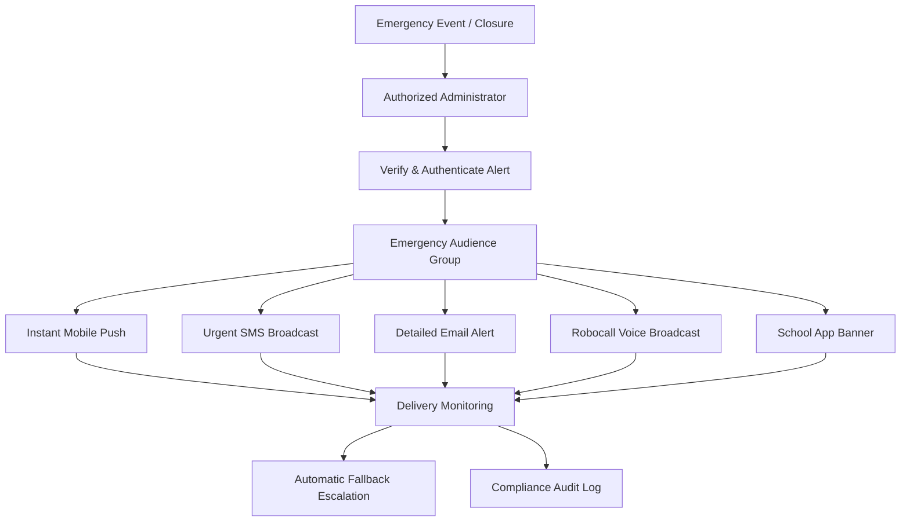
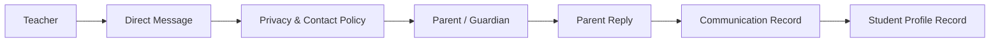
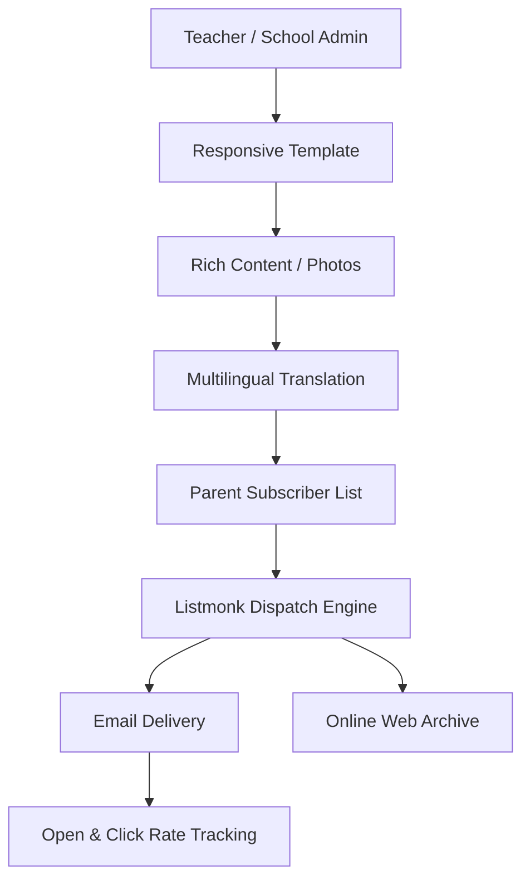
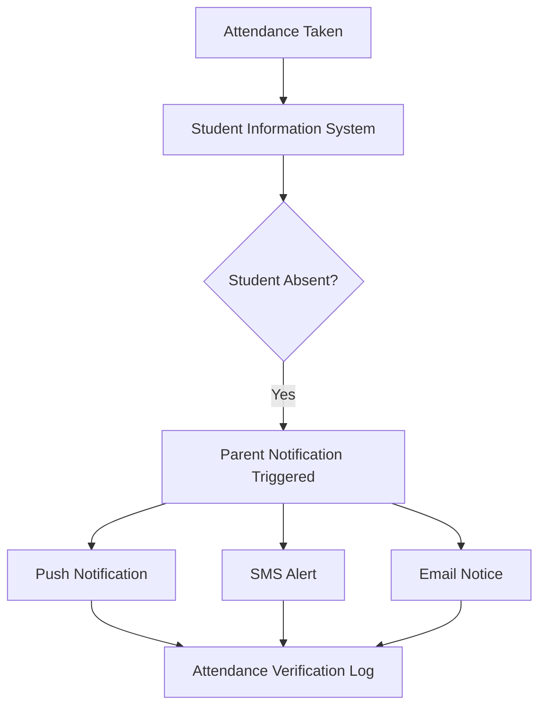
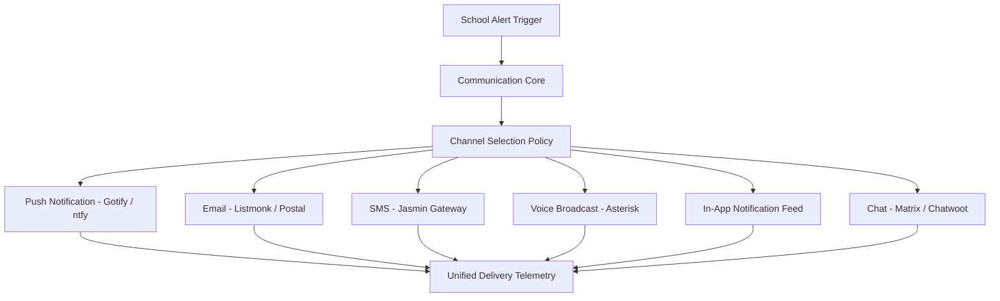

<p align="center">
  
</p>

<p align="center">
  <a href="https://github.com/ishandutta2007/Awesome-Awesome-Awesome"></a><a href="https://discord.gg/jc4xtF58Ve"></a>
  <a href="https://github.com/ishandutta2007/Awesome-School-Communication/stargazers"></a>
  <a href="https://github.com/ishandutta2007/Awesome-School-Communication/network/members"></a>
  <a href="https://github.com/ishandutta2007/Awesome-School-Communication/pulls"></a>
  <a href="https://github.com/ishandutta2007/Awesome-School-Communication/blob/main/LICENSE"></a>
  <a href="https://github.com/ishandutta2007/Awesome-School-Communication/commits/main"></a>
  <a href="https://github.com/ishandutta2007"></a>
</p>

---

# 🏫 Awesome School Communication & Family Engagement

> 📚 **A Curated Directory of SaaS Suites, Open-Source Platforms, Multi-Channel Notification Infrastructure, and Telephony Stacks for K-12 School-to-Home Communication, Parent Engagement, Teacher Messaging, and Emergency Broadcasts.** 🚀

*Open-source-first reference covering K-12 family communication, parent-teacher messaging, emergency alerts, mass notifications, newsletters, announcements, school apps, two-way communication, and the infrastructure required to build self-hosted alternatives.*

📅 **Last updated: September 2026**

---

## 🔍 SEO & Technology Overview

Modern school communication platforms bridge the gap between educational institutions and families across multiple touchpoints:

* 📱 **Multi-Channel Dispatch**: SMS broadcasts, email blasts, automated voice calls, and mobile push notifications.
* 💬 **Two-Way Family Engagement**: Real-time teacher-to-parent messaging, classroom feeds, student portfolios, and private discussions.
* 🚨 **Critical Safety & Emergency Broadcasts**: Rapid lockdown alerts, weather closures, bus schedule disruptions, and safety audits.
* 🌐 **Automated Multilingual Translation**: Seamless 2-way text translation across 150+ languages to overcome linguistic barriers.
* 📊 **SIS-Integrated Workflows**: Automated student attendance notifications, gradebook updates, truancy alerts, and parent portals.
* 📰 **Visual Publishing & Newsletters**: High-engagement digital newsletters, calendar feeds, RSVP tracking, and permission forms.
* 🔒 **Regulatory Privacy Compliance**: Adherence to FERPA, COPPA, CSPC, and student data confidentiality mandates.

Key commercial benchmarks include **SchoolMessenger, Finalsite Messages, ParentSquare, Apptegy Thrillshare, Blackboard Mass Notifications, Remind, Edlio, SchoolStatus, Smore, and Konstella**.

```text
School Website / CMS
       +
Parent Mobile App
       +
Family Portal
       +
Teacher-Parent Chat
       +
Mass Notifications
       +
Emergency Alerts
       +
Newsletters & Stories
       +
SMS / Email / Voice Gateways
       +
Real-Time Translation
       +
SIS / Student Directory
```

---

## 🧭 Table of Contents

* [📊 Market Overview & SaaS/Hosted Platforms](#-saashosted-platforms)
* [💻 Open-Source School Communication Platforms](#-open-source-school-communication-platforms)
* [🏫 Open-Source School Management Platforms with Communication](#-open-source-school-management-platforms-with-communication)
* [🔔 Open-Source Notification Infrastructure](#-open-source-notification-infrastructure)
* [💬 Open-Source Messaging Platforms](#-open-source-messaging-platforms)
* [✉️ Open-Source Email, SMS & Voice Infrastructure](#️-open-source-email-sms--voice-infrastructure)
* [📰 Open-Source Newsletter & Publishing Platforms](#-open-source-newsletter--publishing-platforms)
* [👥 Open-Source Collaboration Platforms](#-open-source-collaboration-platforms)
* [🔐 Open-Source Authentication & Identity](#-open-source-authentication--identity)
* [⭐ Additional Strong Open-Source Options](#-additional-strong-open-source-options)
* [🔄 Commercial Platform → Open-Source Equivalents](#-commercial-platform--open-source-equivalents)
* [🛠️ Frameworks for Building Custom School Communication Systems](#️-frameworks-for-building-custom-school-communication-systems)
* [🏛️ Reference Architecture](#️-reference-architecture)
* [📋 Typical School Communication Workflow](#-typical-school-communication-workflow)
* [🚨 Emergency Notification Workflow](#-emergency-notification-workflow)
* [👨‍🏫 Parent-Teacher Messaging Workflow](#-parent-teacher-messaging-workflow)
* [📰 Newsletter Workflow](#-newsletter-workflow)
* [⏰ Attendance Notification Workflow](#-attendance-notification-workflow)
* [📡 Multichannel Notification Architecture](#-multichannel-notification-architecture)
* [📊 Capability Matrix](#-capability-matrix)
* [📦 Recommended Open-Source Stacks](#-recommended-open-source-stacks)
* [🧩 What Is Still Difficult to Reproduce in Open Source?](#-what-is-still-difficult-to-reproduce-in-open-source)
* [💡 Why Open Source Is Interesting](#-why-open-source-is-interesting)
* [📈 Star History](#-star-history)
* [🤝 How to Contribute](#-how-to-contribute)
* [⚖️ Disclaimer & Compliance](#️-disclaimer--compliance)

---

## 🏢 SaaS/Hosted Platforms

> 💡 **Market Size & Structural Dynamics**: The global K-12 school communication, mass notification, and family engagement software sector represents an estimated **$2.5B to $4.2B addressable market** (growing at an estimated **12–15% CAGR** within the broader $100B+ education technology space). The industry is **moderately fragmented**: major enterprise consolidators (e.g., PowerSchool / Bain Capital, ParentSquare / Carlyle Group, Anthology / Veritas Capital) are driving platform mergers and roll-ups across district-wide mass notification suites, while the ecosystem remains decentralized due to independent school district procurement autonomy, localized data privacy regulations (FERPA, COPPA, CSPC), and extensive grassroots classroom-level adoption by individual educators (e.g., ClassDojo, TalkingPoints, Remind).

*Commercial school communication platforms sorted in **descending order by company size, valuation, or estimated annual revenue**.*

| 🏆 Platform | 🏢 Company Size / Valuation / Est. Revenue | 📝 Primary Model | ⚡ Main Strength | 💲 Pricing | 🎁 Free Tier Limit |
| :--- | :--- | :--- | :--- | :--- | :--- |
| **[PowerSchool](https://www.powerschool.com/)** | **~$5.6B Valuation / ~$740M ARR**<br>*(Acquired by Bain Capital; serves 50M+ students)* | Education platform | SIS + family communication ecosystem | Starts at **~$5.00–$8.00 / student / year** (typical min. annual contract ~$3,000–$5,000 / year) | No permanent free tier for schools (PowerSchool Mobile app is **100% free for parents & students**); **30-day sandbox pilot** on sales request |
| **[SchoolMessenger](https://www.schoolmessenger.com/)** | **~$5.6B Parent Valuation / ~$740M ARR**<br>*(Part of PowerSchool suite; trusted by 63,000+ schools)* | K-12 mass communication | Emergency + mass notifications | Starts at **~$2.00–$5.00 / student / year** (min. annual contract ~$2,000–$5,000 / year) | No permanent free tier for schools (mobile app **100% free for parents**); **30-day evaluation pilot** on sales request |
| **[Blackboard](https://www.anthology.com/products/teaching-and-learning/learning-effectiveness/blackboard)** | **~$3.0B Valuation / ~$650M Revenue**<br>*(Part of Anthology; backed by Veritas Capital & Leeds Equity)* | Education platform | Institutional communication ecosystem | Starts at **~$9,500 / year base** for small institutions (or ~$25.00–$40.00 / FTE student / year) | **Free 30-day trial** of Blackboard Learn (up to 5 courses, 25 students, full instructor tools; no credit card required) |
| **[Blackboard Mass Notifications](https://www.blackboard.com/teaching-learning/communication-collaboration/mass-notifications)** | **~$3.0B Parent Valuation / ~$650M Revenue**<br>*(Anthology K-12 communications division)* | Emergency/mass notification | Alerts + institutional messaging | Starts at **~$2.00–$3.50 / student / year** (min. annual contract ~$2,500 / year) | No permanent free tier; **30-day pilot / sandbox demo** environment on request |
| **[Finalsite](https://www.finalsite.com/)** | **~$1.5B Valuation / ~$150M+ ARR**<br>*(Backed by Bridgepoint; powers 7,000+ school websites)* | K-12 digital platform | Websites + communications | Starts at **~$3,500–$6,000 / year base** + implementation & template setup fees | No permanent free tier; **30-day sandbox trial environment** available upon sales consultation |
| **[Finalsite Messages](https://www.finalsite.com/)** | **~$1.5B Parent Valuation / ~$150M+ ARR**<br>*(Bridgepoint-backed dedicated messaging module)* | School communications | Websites + messaging + engagement | Starts at **~$2.00–$3.00 / student / year** (min. annual contract ~$2,000 / year) | No permanent free tier; **30-day sandbox evaluation trial** available upon sales request |
| **[ClassDojo](https://www.classdojo.com/)** | **~$1.25B Valuation / ~$60M ARR**<br>*(Series D EdTech Unicorn; 50M+ students in 180 countries)* | Family engagement | Teacher-parent communication | **$0 for teachers & schools**; optional ClassDojo Plus for families at **$15.49 / month** ($59.99 / year) | **100% Free forever** for teachers, schools, and families (unlimited messaging & class stories); **7-day free trial** for ClassDojo Plus |
| **[ParentSquare (District Tier)](https://www.parentsquare.com/)** | **~$1.0B+ Valuation / ~$80M–$100M ARR**<br>*(Backed by Carlyle & Luminate; acquired Remind & Gabbart)* | Family engagement | District-wide communication | Starts at **~$5,000–$10,000 / year district base** (~$1.75–$3.00 / student / year) | No permanent free tier for districts (free mobile app for parents); **30-day district evaluation pilot** on request |
| **[ParentSquare](https://www.parentsquare.com/)** | **~$1.0B+ Valuation / ~$80M–$100M ARR**<br>*(Unified family engagement platform for K-12)* | Family engagement | Two-way communication + mass notifications | Starts at **~$3,000 / year base** per school site (~$2.00–$4.00 / student / year) | No permanent free tier for schools (**100% free for parents & students**); **30-day pilot / guided demo** on sales request |
| **[SchoolStatus](https://www.schoolstatus.com/)** | **~$40M–$60M ARR**<br>*(Backed by Align Capital; acquired Smore & ClassTag; 5M+ students)* | Family engagement | Data-driven communication | Starts at **~$2.00–$4.00 / student / year** (base campus fee ~$1,500–$3,000 / school / year) | No permanent free tier for core platform; **30-day district pilot / guided walkthrough** on request |
| **[SchoolStatus Connect](https://www.schoolstatus.com/products/connect-family-school-partnerships)** | **~$40M–$60M Parent ARR**<br>*(Formerly ClassTag; integrated into SchoolStatus ecosystem)* | Family engagement | Messaging + mass notifications + newsletters | **Free for teachers**; School/District packages start at **~$2.00–$3.00 / student / year** (ad-free teacher at $3.99 / month) | **Free forever for classroom teachers** (unlimited family messaging, announcements, and translation); **30-day trial pilot** for districts |
| **[Apptegy Thrillshare](https://www.apptegy.com/)** | **~$35M–$50M ARR**<br>*(Backed by Five Elms Capital; powers 4,000+ districts)* | District communication | Website + app + mass communication | Starts at **~$4,000–$7,500 / year base per district** + ~$2.50–$3.50 / student / year | No permanent free tier; **30-day district evaluation pilot** and interactive demo on request |
| **[Remind](https://www.remind.com/)** | **~$20M ARR**<br>*(Subsidiary of ParentSquare; 30M+ active users)* | Teacher/family messaging | Simple two-way school-home messaging | **Free for teachers**; Remind Hub starts at **~$4,000 / year** (~$3.00–$5.00 / student / year) | **Free forever plan (Remind Chat)** supports up to 10 classes per teacher and 150 participants per class; custom pilot for Hub |
| **[Edlio](https://www.edlio.com/)** | **~$15M–$25M ARR**<br>*(Backed by Linsalata Capital Partners; powers 10,000+ schools)* | School communications | Website + CMS + mobile communication | Starts at **~$2,500–$4,500 / year base** per school site + setup fees | No permanent free tier; **30-day full-feature sandbox demo / trial** on sales request |
| **[TalkingPoints](https://talkingpts.org/)** | **~$8M–$12M Budget**<br>*(501(c)(3) Non-Profit supported by Google.org & Schmidt Futures)* | Family engagement | Multilingual two-way communication | **$0 for individual teachers**; School/District plans start at **~$2.50–$4.00 / student / year** | **Free forever teacher plan** includes up to 5 classes and 200 students with 2-way translation; **30-day district pilot** on request |
| **[Bloomz](https://www.bloomz.com/)** | **~$5M–$10M ARR**<br>*(Trusted by 3M+ teachers, parents, and administrators)* | School communication | Messaging + announcements + parent engagement | Free tier available; Teacher Premium at **$125.00 / year**; Schoolwide Premium starts at **~$3.00 / student / year** (~$1,500/yr min) | **Free forever teacher plan** (1 class, up to 30 students, 1 Admin + 1 Co-Teacher); **14-day free trial** for Teacher Premium |
| **[TeacherEase](https://www.teacherease.com/)** | **~$5M–$10M ARR**<br>*(Common Goal Systems; trusted by private & public schools)* | School communication | Parent/teacher communication | Starts at **$175.67 / teacher / year** (tier for 1–19 teachers; no per-student fee) | No permanent free tier for teachers (parent & student access is **100% free**); **30-day guided pilot / demo** for schools on request |
| **[Smore](https://www.smore.com/)** | **~$5M–$8M ARR**<br>*(1M+ active educators; SchoolStatus subsidiary)* | School newsletters | Newsletter creation + distribution | Free tier available; Educator Pro starts at **$79.00 / year** ($15.00 / month); Team plans from **$399.00 / year** | **Free forever plan** allows up to 5 newsletters with Smore branding; Pro plan offers a **30-day free trial** (no credit card required) |
| **[Campus Suite](https://www.campussuite.com/)** | **~$3M–$6M ARR**<br>*(Innersync Studio K-12 communications provider)* | School websites/communication | Websites + mobile communication | Starts at **~$2,500–$4,000 / year base** per school (~$1.50–$3.00 / student / year) | No permanent free tier; **30-day interactive sandbox demo / trial environment** on request |
| **[SchoolInfoApp](https://www.schoolinfoapp.com/)** | **~$2M–$5M ARR**<br>*(Edlio subsidiary; powers branded mobile school apps)* | School communication | Mobile app + notifications | Starts at **~$1,500 / year base** per school (~$1.50–$2.50 / student / year + setup fee) | No permanent free tier for schools (mobile app **100% free for parents/students**); **30-day pilot trial** on request |
| **[Konstella](https://www.konstella.com/)** | **~$1M–$2M ARR**<br>*(Specialized school-parent community & PTA platform)* | Parent/school community | School-community communication | Starts at **$424 / year (Basic)**, **$849 / year (Premium)**, and **$1,049 / year (Platinum)** flat fee per school | No permanent free tier for schools (**100% free for parents & PTA members**); **30-day free trial** for parent associations |

SchoolStatus Connect currently combines mass notifications, two-way messaging, a family app, and Smore newsletters, illustrating how the market is converging toward unified communications hubs.

### 📌 Important 2026 Market Note
**Remind is now part of ParentSquare.** ParentSquare completed the acquisition of Remind, unifying two of the largest K-12 family communication networks under a single umbrella.

---

## 💻 Open-Source School Communication Platforms

*Dedicated open-source school communication projects and family portals, sorted by GitHub star count (descending).*

* **[Gibbon](https://github.com/GibbonEdu/core)** [](https://github.com/GibbonEdu/core/stargazers)
  Established, mature open-source school management platform with notices, parent/student dashboards, messaging workflows, calendars, and attendance tracking. (GPL-3.0)

* **[crazymodifier / School Management System](https://github.com/crazymodifier/school-management-system)** [](https://github.com/crazymodifier/school-management-system/stargazers)
  PHP/MySQL self-hosted school portal with student, teacher, parent, and admin dashboards, broadcast announcements, and attendance notifications.

* **[okoyechuka / School Management Software](https://github.com/okoyechuka/school-managment-software)** [](https://github.com/okoyechuka/school-managment-software/stargazers)
  Full school management software featuring a dedicated communication module for bulk SMS, email, and staff/parent messaging.

* **[fadkeabhi / School Notification Management System](https://github.com/fadkeabhi/School-Notification-Managment-System)** [](https://github.com/fadkeabhi/School-Notification-Managment-System/stargazers)
  MERN stack application specifically built for school notification delivery, teacher class posts, parent accounts, and in-app/email notifications.

* **[Bennacci / eCommunicationBook](https://github.com/Bennacci/eCommunicationBook)** [](https://github.com/Bennacci/eCommunicationBook/stargazers)
  Digital school-home communication diary concept designed for parent-teacher notes, homework feeds, calendars, and performance reports.

* **[TemiKayode / SchoolMS](https://github.com/TemiKayode/School-Management-System)** [](https://github.com/TemiKayode/School-Management-System/stargazers)
  Modern full-stack school management system featuring role-based dashboards, real-time messaging, announcements, and push notifications.

* **[shabirkhan-dev / School OS](https://github.com/shabirkhan-dev/school-os)** [](https://github.com/shabirkhan-dev/school-os/stargazers)
  Mobile-first school operating system combining Next.js, Expo, NestJS, and WhatsApp integration for instant parent attendance alerts and campus communication.

* **[GIT-ARYA / Parent-Teacher Portal](https://github.com/GIT-ARYA/PTPortal)** [](https://github.com/GIT-ARYA/PTPortal/stargazers)
  Full-stack parent-teacher communication portal supporting real-time chat, student progress, grades, announcements, and parent meeting scheduling.

* **[saismrutiranjan18 / School Management System](https://github.com/saismrutiranjan18/School-Management-System)** [](https://github.com/saismrutiranjan18/School-Management-System/stargazers)
  MERN-stack school portal integrating announcements, class-specific communication, real-time push alerts, and parent messaging.

---

## 🏫 Open-Source School Management Platforms with Communication

*Student Information Systems (SIS) and ERPs that supply the foundational student-family data model required by communication engines, sorted by GitHub star count (descending).*

* **[Odoo](https://github.com/odoo/odoo)** [](https://github.com/odoo/odoo/stargazers)
  Extensible open-source ERP with dedicated Education modules for managing student records, guardian portals, attendance notifications, and admissions.

* **[Frappe ERPNext](https://github.com/frappe/erpnext)** [](https://github.com/frappe/erpnext/stargazers)
  Comprehensive open-source ERP framework featuring an Education module for admissions, guardian tracking, assessment reports, and automated SMS/email triggers.

* **[OpenEduCat](https://github.com/openeducat/openeducat_erp)** __STAR_openeducat/openeducat_erp__
  Odoo-based open-source education platform featuring parent access portals, classroom assignment feeds, timetable tracking, and automated parent notifications.

* **[RosarioSIS](https://github.com/francoisjacquet/rosariosis)** [](https://github.com/francoisjacquet/rosariosis/stargazers)
  Free and open-source PHP/PostgreSQL Student Information System with built-in parent/student portals, disciplinary records, attendance logs, and notifications.

* **[Frappe Education](https://github.com/frappe/education)** [](https://github.com/frappe/education/stargazers)
  Dedicated education application built on the Frappe framework for student records, guardian links, academic structure, and communication workflows.

* **[Fedena](https://github.com/projectfedena/fedena)** [](https://github.com/projectfedena/fedena/stargazers)
  Ruby on Rails school-management platform with student/parent profiles, attendance logs, announcements, and internal messaging.

* **[openSIS Classic](https://github.com/OS4Ed/openSIS-Classic)** [](https://github.com/OS4Ed/openSIS-Classic/stargazers)
  Open-source student information system supporting demographics, scheduling, attendance tracking, and parent portal access.

* **[AlekSIS](https://github.com/AlekSIS/official)** [](https://github.com/AlekSIS/official/stargazers)
  Modern Django-based school information system designed for digital school organization, group calendars, and notification workflows.

* **[Sentrifugo](https://github.com/sapplica/sentrifugo)** [](https://github.com/sapplica/sentrifugo/stargazers)
  Role-based organizational management system useful as a reference architecture for RBAC and staff communication hierarchies.

---

## 🔔 Open-Source Notification Infrastructure

*Notification engines and orchestration frameworks connecting school triggers to multi-channel delivery, sorted by GitHub star count (descending).*

* **[n8n](https://github.com/n8n-io/n8n)** [](https://github.com/n8n-io/n8n/stargazers)
  Fair-code workflow automation platform ideal for connecting SIS triggers (e.g. absences) to notification providers (Twilio, SendGrid, WhatsApp).

* **[Novu](https://github.com/novuhq/novu)** [](https://github.com/novuhq/novu/stargazers)
  Unified open-source notification infrastructure supporting in-app inboxes, push, email, SMS, and chat routing workflows with centralized template management.

* **[ntfy](https://github.com/binwiederhier/ntfy)** [](https://github.com/binwiederhier/ntfy/stargazers)
  Lightweight HTTP-based publish/subscribe push notification server allowing schools to broadcast instant alerts to parent phones and desktops via simple HTTP POST calls.

* **[Node-RED](https://github.com/node-red/node-red)** [](https://github.com/node-red/node-red/stargazers)
  Low-code visual event-driven workflow tool for automating school bell notifications, attendance alerts, and emergency alert escalation.

* **[Temporal](https://github.com/temporalio/temporal)** [](https://github.com/temporalio/temporal/stargazers)
  Durable workflow engine ensuring mission-critical reliability for emergency broadcasts, delivery confirmations, and voice fallback escalations.

* **[Apprise](https://github.com/caronc/apprise)** [](https://github.com/caronc/apprise/stargazers)
  Lightweight multi-notification library supporting push alerts across 90+ endpoints (Telegram, Discord, SMS, Email, Pushbullet).

* **[Gotify](https://github.com/gotify/server)** [](https://github.com/gotify/server/stargazers)
  Simple self-hosted push notification server with Android client and REST API for real-time internal school and administrative alerts.

---

## 💬 Open-Source Messaging Platforms

*Self-hosted messaging systems for teacher-parent chat, grade-level channels, and school staff collaboration, sorted by GitHub star count (descending).*

* **[Rocket.Chat](https://github.com/RocketChat/Rocket.Chat)** [](https://github.com/RocketChat/Rocket.Chat/stargazers)
  Secure open-source communications platform with channels, direct messaging, Omnichannel parent inquiry inboxes, and native mobile apps.

* **[Mattermost](https://github.com/mattermost/mattermost)** [](https://github.com/mattermost/mattermost/stargazers)
  Open-source secure collaboration platform with structured channels, automated webhooks, and strict compliance features for school staff and departments.

* **[Chatwoot](https://github.com/chatwoot/chatwoot)** [](https://github.com/chatwoot/chatwoot/stargazers)
  Omnichannel live messaging platform for school support, parent inboxes, WhatsApp, SMS, and website chat integration.

* **[Zulip](https://github.com/zulip/zulip)** [](https://github.com/zulip/zulip/stargazers)
  Unique topic-based threaded messaging platform keeping school announcements and classroom conversations organized and searchable.

* **[Element Web](https://github.com/element-hq/element-web)** [](https://github.com/element-hq/element-web/stargazers)
  Feature-rich Matrix web and desktop client supporting end-to-end encrypted messaging, voice/video calls, and cross-platform parent-teacher communication.

* **[Matterbridge](https://github.com/42wim/matterbridge)** [](https://github.com/42wim/matterbridge/stargazers)
  Multi-protocol chat bridge connecting Matrix, Discord, Mattermost, Rocket.Chat, Slack, Telegram, and IRC into unified school messaging streams.

* **[Matrix Synapse](https://github.com/element-hq/synapse)** [](https://github.com/element-hq/synapse/stargazers)
  Open-source reference Matrix homeserver providing decentralized, interoperable, and federated real-time communication infrastructure.

* **[Nextcloud Talk](https://github.com/nextcloud/spreed)** [](https://github.com/nextcloud/spreed/stargazers)
  Self-hosted chat, video calling, and screen sharing platform integrated directly into the Nextcloud school ecosystem.

---

## ✉️ Open-Source Email, SMS & Voice Infrastructure

*Infrastructure components for delivering email blasts, SMS text broadcasts, and automated telephony voice messages, sorted by GitHub star count (descending).*

### 📬 Email Delivery
* **[Listmonk](https://github.com/knadh/listmonk)** [](https://github.com/knadh/listmonk/stargazers)
  High-performance self-hosted newsletter and mailing list manager with multi-threading, custom subscriber attributes, and analytics.
* **[Postal](https://github.com/postalserver/postal)** [](https://github.com/postalserver/postal/stargazers)
  Full-featured self-hosted mail delivery platform for transaction and bulk email routing.
* **[Mailcow: Dockerized](https://github.com/mailcow/mailcow-dockerized)** [](https://github.com/mailcow/mailcow-dockerized/stargazers)
  Complete self-hosted mailserver suite with SOGo webmail, spam protection, and DKIM signing.
* **[Mailu](https://github.com/mailu/mailu)** [](https://github.com/mailu/mailu/stargazers)
  Lightweight and modular Docker-based mail server suite.

### 📱 SMS Gateways
* **[Jasmin SMS Gateway](https://github.com/jookies/jasmin)** [](https://github.com/jookies/jasmin/stargazers)
  Enterprise open-source SMS gateway with high-throughput SMPP message routing, billing management, and automatic failover.
* **[RapidPro](https://github.com/rapidpro/rapidpro)** [](https://github.com/rapidpro/rapidpro/stargazers)
  Visual flow-based engine built by UNICEF for creating multi-channel interactive SMS, WhatsApp, and voice chatbots for family engagement.
* **[PlaySMS](https://github.com/playsms/playsms)** [](https://github.com/playsms/playsms/stargazers)
  Flexible Web-based SMS management system supporting multiple SMS gateways.
* **[Gammu](https://github.com/gammu/gammu)** [](https://github.com/gammu/gammu/stargazers)
  Cellular modem and SMS command-line utility for local SIM-based SMS sending.
* **[Kannel](https://github.com/kannel-sms/kannel)** [](https://github.com/kannel-sms/kannel/stargazers)
  High-capacity WAP and SMS gateway widely used for carrier integration.

### 📞 Voice Telephony
* **[FreeSWITCH](https://github.com/signalwire/freeswitch)** [](https://github.com/signalwire/freeswitch/stargazers)
  Scalable open-source telephony platform routing audio, video, and text for automated voice calling.
* **[Asterisk](https://github.com/asterisk/asterisk)** [](https://github.com/asterisk/asterisk/stargazers)
  The world's leading open-source PBX and voice communications toolkit for building automated emergency voice broadcast systems.
* **[Jambonz](https://github.com/jambonz/sbc-in-the-cloud)**
  Open-source voice API platform for developers, ideal for integrating SIP trunks into school alert flows.

---

## 📰 Open-Source Newsletter & Publishing Platforms

*Content management systems and visual publishing platforms for school news and parent bulletins, sorted by GitHub star count (descending).*

* **[Ghost](https://github.com/TryGhost/Ghost)** [](https://github.com/TryGhost/Ghost/stargazers)
  Modern open-source publishing platform and newsletter system with membership tiers, email subscriptions, and analytics.

* **[Listmonk](https://github.com/knadh/listmonk)** [](https://github.com/knadh/listmonk/stargazers)
  High-speed mailing list manager capable of sending millions of parent newsletters per hour with rich templating.

* **[Mautic](https://github.com/mautic/mautic)** [](https://github.com/mautic/mautic/stargazers)
  Open-source marketing and communication automation suite supporting segmented parent email campaigns and engagement tracking.

* **[Drupal](https://github.com/drupal/drupal)** [](https://github.com/drupal/drupal/stargazers)
  Enterprise-grade open-source CMS widely utilized by school districts and universities for accessible web publishing and portals.

* **[WordPress](https://github.com/WordPress/wordpress-develop)** [](https://github.com/WordPress/wordpress-develop/stargazers)
  Versatile open-source CMS powering school websites, announcement blogs, and classroom newsletters with extensive plugin support.

---

## 👥 Open-Source Collaboration Platforms

*Virtual meeting rooms, video classrooms, and document sharing tools for parents and teachers, sorted by GitHub star count (descending).*

| 📦 Platform | 🌟 GitHub Stars | 🎯 Main Educational Use Case |
| --- | --- | --- |
| **[Nextcloud](https://github.com/nextcloud/server)** | [](https://github.com/nextcloud/server/stargazers) | Self-hosted school cloud for student files, parent permissions, and groupware |
| **[Jitsi Meet](https://github.com/jitsi/jitsi-meet)** | [](https://github.com/jitsi/jitsi-meet/stargazers) | Encrypted 100% open-source video conferencing for virtual parent-teacher conferences |
| **[BigBlueButton](https://github.com/bigbluebutton/bigbluebutton)** | [](https://github.com/bigbluebutton/bigbluebutton/stargazers) | Virtual classroom platform with whiteboards, breakout rooms, and remote parent presentations |
| **[Moodle](https://github.com/moodle/moodle)** | [](https://github.com/moodle/moodle/stargazers) | World-leading LMS with parent observer accounts, course updates, and notifications |
| **[Canvas LMS](https://github.com/instructure/canvas-lms)** | [](https://github.com/instructure/canvas-lms/stargazers) | Open-source core LMS providing parent observer access and syllabus announcements |

---

## 🔐 Open-Source Authentication & Identity

*Identity and access management ensuring secure parent logins and FERPA-compliant RBAC, sorted by GitHub star count (descending).*

* **[Keycloak](https://github.com/keycloak/keycloak)** [](https://github.com/keycloak/keycloak/stargazers)
  Open-source identity and access management solution providing SSO, OpenID Connect, SAML 2.0, multi-factor authentication (MFA), and role-based access.

* **[Authelia](https://github.com/authelia/authelia)** [](https://github.com/authelia/authelia/stargazers)
  Lightweight open-source authentication and authorization server offering two-factor authentication and reverse proxy integration.

* **[Authentik](https://github.com/goauthentik/authentik)** [](https://github.com/goauthentik/authentik/stargazers)
  Modern, flexible identity provider with self-service password reset, flow builders, and parent portal OAuth2/SAML integrations.

---

## ⭐ Additional Strong Open-Source Options

*Curated ecosystem tools for building comprehensive school communication systems, sorted within each category by GitHub star count (descending).*

### 📱 Mobile & Front-End Frameworks
* **[Flutter](https://github.com/flutter/flutter)** [](https://github.com/flutter/flutter/stargazers) - Google's cross-platform UI toolkit for iOS/Android parent apps.
* **[React Native](https://github.com/facebook/react-native)** [](https://github.com/facebook/react-native/stargazers) - Native mobile app development framework.
* **[Ionic](https://github.com/ionic-team/ionic-framework)** [](https://github.com/ionic-team/ionic-framework/stargazers) - Cross-platform mobile and PWA framework.
* **[Expo](https://github.com/expo/expo)** [](https://github.com/expo/expo/stargazers) - Fast React Native development suite and notification service.

### 📅 Scheduling, CRM & Forms
* **[Twenty](https://github.com/twentyhq/twenty)** [](https://github.com/twentyhq/twenty/stargazers) - Modern CRM for school admissions, student tracking, and family relations.
* **[Cal.com](https://github.com/calcom/cal.com)** [](https://github.com/calcom/cal.com/stargazers) - Open-source scheduling platform for parent-teacher conferences and staff booking.
* **[Formbricks](https://github.com/formbricks/formbricks)** [](https://github.com/formbricks/formbricks/stargazers) - Privacy-first survey and form suite for parent feedback, permissions, and polls.

### 🌐 Translation Engines (Multilingual Family Support)
* **[LibreTranslate](https://github.com/LibreTranslate/LibreTranslate)** [](https://github.com/LibreTranslate/LibreTranslate/stargazers) - Free and open-source machine translation engine for real-time message translation.
* **[Argos Translate](https://github.com/argosopentech/argos-translate)** - Offline open-source translation library.
* **[Marian NMT](https://github.com/marian-nmt/marian-dev)** - Fast neural machine translation framework in C++.

---

## 🔄 Commercial Platform → Open-Source Equivalents

| Commercial / Hosted Platform | Closest Open-Source Stacks | Practical Integration Notes |
| --- | --- | --- |
| **SchoolMessenger** | Gibbon + Novu + Jasmin + Asterisk | Strong DIY mass-notification and emergency broadcast architecture |
| **Finalsite Messages** | Gibbon + WordPress/Drupal + Novu | Content management + unified multi-channel notifications |
| **ParentSquare** | Gibbon + School Notification System + Novu + Matrix | Two-way family messaging requires Matrix/Chatwoot bridge with SIS |
| **Apptegy Thrillshare** | WordPress/Drupal + Expo/Flutter + Novu | Custom branded mobile app + website CMS + push notifications |
| **Blackboard Mass Notifications** | Novu + ntfy + Jasmin + Asterisk | Multi-channel broadcast infrastructure for institutional alerts |
| **Remind** | Matrix + Rocket.Chat + Novu + PTPortal | Direct teacher-parent messaging with cell number privacy protection |
| **Edlio** | WordPress/Drupal + Gibbon + Novu + PWA | Website publishing + parent mobile communication |
| **SchoolStatus** | Gibbon + SIS + Novu + Grafana / Metabase | Data-driven family engagement and attendance intervention analytics |
| **Smore** | Listmonk + Mautic + Ghost / WordPress | Rich visual newsletters with recipient open/click tracking |
| **Konstella** | Matrix / Rocket.Chat + Cal.com + Novu | Community messaging, event calendars, and parent association management |
| **TalkingPoints** | Matrix + LibreTranslate + Novu + Jasmin | Multilingual two-way SMS and chat translation engine |
| **ClassDojo** | Gibbon + Matrix + Novu + Mobile App | Classroom behavior points, stories, and parent updates |
| **Bloomz** | Gibbon + Rocket.Chat + Novu + Cal.com | Unified messaging, calendar signups, and parent engagement |
| **SchoolInfoApp** | Gibbon + Flutter / Expo + Novu | Branded school mobile application with push notification feeds |
| **Campus Suite** | WordPress / Drupal + Novu + Apprise | School district CMS and community messaging |
| **Generic School Communication** | Gibbon + Novu + Listmonk + Matrix | Strong modular starting foundation for self-hosted school districts |

---

## 🛠️ Frameworks for Building Custom School Communication Systems

A production-grade open-source school communication system combines several architectural tiers:

```text
School
 ├── Campus
 │    ├── Grade Level
 │    │    ├── Classroom
 │    │    │    ├── Student
 │    │    │    │    └── Guardians (Parents / Contacts)
 │    │    │    └── Teacher / Co-Teachers
 │    └── Staff & Administration
 └── Special Cohorts (Bus Routes, Sports Teams, Clubs, Special Education)
```

```text
Audience Selection (SIS) ──> Message Composition ──> Multi-Language Translation
                                                              │
                                                              ▼
Delivery Confirmation <── Dispatch Orchestration <── Channel Policy (SMS/Push/Voice/Email)
```

---

## 🏛️ Reference Architecture



---

## 📋 Typical School Communication Workflow



---

## 🚨 Emergency Notification Workflow



---

## 👨‍🏫 Parent-Teacher Messaging Workflow



---

## 📰 Newsletter Workflow



---

## ⏰ Attendance Notification Workflow



---

## 📡 Multichannel Notification Architecture



---

## 📊 Capability Matrix

| Capability | SchoolMessenger | ParentSquare | Apptegy | Finalsite | Remind | SchoolStatus | Smore | Gibbon | Novu | Matrix |
| --- | :---: | :---: | :---: | :---: | :---: | :---: | :---: | :---: | :---: | :---: |
| **Mass Notifications** | ✅ | ✅ | ✅ | ✅ | ✅ | ✅ | Limited | Via modules | ✅ | Via integration |
| **Two-Way Messaging** | ✅ | ✅ | ✅ | ✅ | ✅ | ✅ | Limited | Via modules | Workflow | ✅ |
| **Parent Portal** | ✅ | ✅ | ✅ | ✅ | ✅ | ✅ | ❌ | ✅ | ❌ | ❌ |
| **School Website** | Ecosystem | Ecosystem | ✅ | ✅ | ❌ | ❌ | ❌ | Via modules | ❌ | ❌ |
| **Mobile App** | ✅ | ✅ | ✅ | ✅ | ✅ | ✅ | Limited | Custom | Via integration | Clients |
| **SMS Gateway** | ✅ | ✅ | ✅ | ✅ | ✅ | ✅ | Integration | Integration | Via provider | Integration |
| **Email Blast** | ✅ | ✅ | ✅ | ✅ | ✅ | ✅ | ✅ | Integration | ✅ | Integration |
| **Voice Broadcast** | ✅ | ✅ | ✅ | Integration | Limited | ✅ | ❌ | Integration | Via provider | Integration |
| **Emergency Alerts** | ✅ | ✅ | ✅ | ✅ | ✅ | ✅ | Limited | Custom | ✅ | Custom |
| **Newsletters** | ✅ | ✅ | ✅ | ✅ | Limited | ✅ | ✅ | Custom | Workflow | Custom |
| **Translation** | ✅ | ✅ | ✅ | ✅ | ✅ | ✅ | ✅ | Custom | Provider | Custom |
| **Audience Filters** | ✅ | ✅ | ✅ | ✅ | Limited | Strong | Limited | ✅ | ✅ | Custom |
| **Attendance Alerts** | Via SIS | Via SIS | Via SIS | Via SIS | Integration | ✅ | Limited | ✅ | Integration | Custom |
| **Analytics** | ✅ | ✅ | ✅ | ✅ | Limited | ✅ | ✅ | Via BI | Telemetry | Custom |
| **Self-Hosted** | ❌ | ❌ | ❌ | ❌ | ❌ | ❌ | ❌ | ✅ | ✅ | ✅ |
| **Open Source** | ❌ | ❌ | ❌ | ❌ | ❌ | ❌ | ❌ | ✅ | ✅ | ✅ |

---

## 📦 Recommended Open-Source Stacks

### 1. 🌟 Best Overall School Communication Stack
`Gibbon + Novu + Listmonk + Gotify + Jasmin + Keycloak`
* **Student/Family Records**: Gibbon
* **Notification Orchestration**: Novu
* **Newsletters & Bulk Email**: Listmonk
* **Mobile Push Alerts**: Gotify / ntfy
* **SMS Gateway**: Jasmin
* **Identity & SSO**: Keycloak

### 2. 💬 Best Parent-Teacher Messaging Stack
`Gibbon + Matrix Synapse + Element + Novu`
* Direct end-to-end encrypted messaging between teachers and families
* Controlled classroom channels and parent groups
* Automated notifications for missed chats via Novu

### 3. 🚨 Best Mass-Notification & Emergency Stack
`Gibbon + Novu + Jasmin + Postal + Asterisk`
* High-volume simultaneous SMS broadcasts via Jasmin
* Transactional emergency emails via Postal
* Automated voice robocall dispatch via Asterisk PBX

### 4. 📰 Best Newsletter & Family Publishing Stack
`Ghost / WordPress + Listmonk + Mautic`
* Rich visual story composition and school updates
* Segmented parent mailing lists and readership engagement analytics

### 5. 🏢 Best Fully Self-Hosted Enterprise District Stack
`Gibbon + Novu + Matrix + Listmonk + Gotify + Jasmin + Asterisk + Keycloak + PostgreSQL + Redis + MinIO + Grafana`
* End-to-end data residency, zero third-party vendor lock-in, and full FERPA/GDPR compliance control.

---

## 🧩 What Is Still Difficult to Reproduce in Open Source?

1. **Nationwide Telecom Delivery**: Open source provides the routing logic, but actual SMS and voice delivery requires carrier integrations and per-message telephony termination costs.
2. **Carrier Delivery Verification**: Tracking carrier-level bounces, spam filtering, and telecom opt-out compliance requires active sender reputation management.
3. **Complex SIS Integration**: Matching dynamic parent-guardian relationships, custodial rights, and contact preferences from commercial legacy SIS systems (PowerSchool, Infinite Campus, Skyward).
4. **Emergency Concurrency**: Broadcasting tens of thousands of messages within seconds during critical school lockdowns without throttling requires massive cloud queue infrastructure.
5. **Mobile Store Management**: Maintaining white-label iOS and Android apps across Apple App Store and Google Play review policies.

---

## 💡 Why Open Source Is Interesting

* 🔒 **Data Sovereignty**: Keep student records, guardian contact numbers, and communication transcripts completely private on school-owned servers.
* 💰 **No Per-Student Licensing Fees**: Avoid recurring annual vendor fees that escalate as student enrollment grows.
* 🛠️ **Customizability**: Tailor communication workflows, approval policies, and language translation models to regional community needs.
* 🔗 **Open Standards**: Seamlessly connect with modern open-source SIS, LMS, and workflow tools without proprietary vendor lock-in.

---

## 📈 Star History

[](https://star-history.dera.page/#ishandutta2007/Awesome-School-Communication&type=date&legend=top-left)

---

## 🤝 How to Contribute

Contributions and suggestions are welcome! Here is how you can help:

* ➕ Add new open-source school communication tools or parent portal projects
* 📝 Document carrier SMS and voice PBX configurations for school alerts
* 🌐 Share open-source multilingual translation pipelines
* 🧪 Contribute architectural workflows, security guidelines, and FERPA/GDPR best practices

Please see the contribution guidelines or submit a pull request!

---

## ⚖️ Disclaimer & Compliance

This repository is a curated community directory for educational and architectural research purposes. It does not constitute legal advice or formal endorsement. Educational institutions must ensure that any self-hosted or SaaS deployment complies with applicable student privacy regulations, including **FERPA, COPPA, CSPC, and GDPR**.
